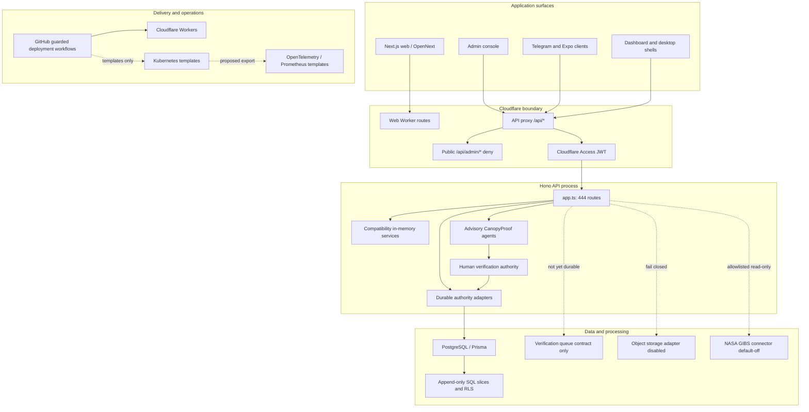

# CanopyProof Current-State Architecture Review

Date: 2026-07-17

Scope: Phase 0 review of the current `dropin-earth` tree inside the
`Dropineth/dropin` monorepo, refreshed after the non-production Visual Evidence
Intelligence foundation and the default-off NASA GIBS connector were added. No
deployment workflow, production report, or release state was changed by this
review.

Important local-state note: the Git repository root is `/Users/lee/Dropin`, while
this product workspace lives at `/Users/lee/Dropin/dropin-earth`. The inspected
worktree is branch `canopyproof/edge-security-hardening` at
`41d7e423ac911a412be30c0fb6f481c99ddeefe7`, with a large dirty set of modified
and untracked files. At review time the repository contained 322 tracked files,
87 modified entries, and 317 untracked entries. This review describes the
checked-out local tree, not a clean remote release commit; most of the reviewed
CanopyProof OS implementation is therefore not yet a versioned, reviewable
release baseline.

## Review Method And Evidence

This review inventories the current filesystem and inspects package manifests,
route modules, the Hono composition root, Prisma and SQL contracts, repository
adapters, agent packages, GitHub workflows, Cloudflare/OpenNext configuration,
Kubernetes/observability manifests, documentation, and test entry points. It
uses the locally executed Node.js 24.14.0/npm 10.9.4 validation baseline of 853
unit tests, 39 PGlite/database tests, previously executed disposable native PostgreSQL 17.10 gates, full workspace
lint/typecheck/build, moderate npm audit, and the OpenNext Cloudflare build plus
local workerd route smoke. Those results establish local consistency only; they
do not prove remote reproducibility, production migration/role behavior, live
provider compatibility, production SLOs, or institutional approval.

## Executive Summary

CanopyProof now has the skeleton and a widening institutional trust foundation
for a climate-proof platform: a public Next.js/OpenNext web app, a Hono API
service, Prisma/PostgreSQL persistence, deterministic lottery/payment/fund/
evidence engines, Cloudflare Worker routing, release gates, safety tests, and
substantial architecture/security documentation.

It is not yet a complete "CanopyProof OS" for institutional environmental
governance. The exact target module routes now exist as OpenNext Worker product
surfaces, and service contracts cover evidence media, advisory verification,
TerraProof, ESG/institutional reporting, governance approvals, partner
collaboration, funding transparency, early warning, observability, resilience,
and append-only SQL slices. These layers are at different maturity levels:
selected trust-authority writes have PostgreSQL/PGlite-backed append-only
implementations, while most visible institutional pages use hard-coded module
projections and several API domains remain process-local maps. Production work
therefore includes missing runtime capabilities as well as hardening: real
storage/scanner/provider integrations, durable workers, production database
concurrency tests, accreditation operations, staffed human review, and
independent audit verification are still required before real-world claims or
institutional operations. The current tree also contains a durable,
append-only Environmental Proof challenge authority, a privacy-minimized Earth
projection for the Global Command Center, and a proposed TerraProof spatial
architecture package. The challenge authority remains route-gated pending
security review. The Earth projection is read-only and defaults every region to
withheld unless a separate dual-reviewed disclosure is supplied. The broader
spatial fabric remains design-only with its ADR implementation gate explicitly
closed.

The 2026-07-14 refresh found 6 application directories, 26 package directories,
2 service directories, 36 Next.js web page modules, 108 unit-test files, 9
integration-test files, 12 E2E source files, 137 documentation files, 12 SQL
schema/rollback files, and 444 Hono route declarations in
`services/api/src/app.ts`. These counts describe breadth, not readiness. The
large route count in one composition root, extensive compatibility-memory
services, static institutional UI projections, and mixed dirty worktree are
material ownership, security-review, and operational risks.

The refresh also includes a typed Visual Evidence Intelligence and 3D
structural-MRV foundation. It defines point-cloud, sensor-domain, license,
immutable review-queue, human-review, field-verification, decoy, provenance,
and observability contracts plus an isolated FiftyOne plugin scaffold. It is
not mounted in the API, has not processed real imagery or point clouds, and is
explicitly assessed as not ready for institutional or production data.

The default-off NASA GIBS connector is the first bounded external Earth-
observation integration with a real upstream protocol contract. It normalizes
allowlisted WMTS/WMS capabilities into append-only catalog records, supports
short-lived signed map manifests, records attribution, and presents a client-
only MapLibre/deck workbench on `/terra`. It has not synchronized live NASA
data, has no composed production signer or controlled-egress policy, and must
not be counted as verified evidence, numerical science data, or proof
authority.

## Current Runtime Map

## Repository Topology

### Applications

- `apps/web`: public CanopyProof web app on Next.js 15 / React 19 with OpenNext
  Cloudflare Worker deployment. It exposes homepage, about, FAQ, status,
  campaigns, lottery, projects, certificates, challenges, payments, feedback,
  fund, red-team, draw, demo, dashboard, and the institutional OS surfaces:
  global command center, mobile evidence reporting, TerraProof, ESG reporting,
  governance, partners, funding transparency, and early-warning risk. With the
  exception of the default-off NASA GIBS client on `/terra` and the strict,
  fail-closed Global Command Center client and public-safe Earth projection on
  `/dashboard/global`, those
  institutional OS pages currently render typed static module descriptions
  rather than live authenticated operational data.
- `apps/admin`: operations console skeleton with status/risk-oriented pages.
- `apps/miniapp-ton`: Telegram Mini App growth/payment entry surface.
- `apps/miniapp-ton-expo`: Expo/React Native scaffold with Three.js/Expo GL.
- `apps/dropin-dashboard`: public environmental dashboard app.
- `apps/dropin-desktop`: local-first environmental operations console shell.

### Services

- `services/api`: Hono API service with Prisma and in-memory repository
  adapters. It has domains for lottery, campaigns, payments, funds, impact,
  evidence, certificates, risk, challenges, status/readiness, feedback, Telegram,
  proof-of-planting, carbon accounting, PoCC/AHIN, governance, analytics,
  external partners, content education, community engagement, operational
  infrastructure, and CanopyProof-specific institutional trust services for
  proof records, media evidence, verification queues, TerraProof, ESG/
  institutional reporting, partners, funding transparency, early warning,
  observability, security, and resilience. Its 444 route declarations are
  composed in one `app.ts`; persistence maturity varies by bounded context.
- `services/ahin-collector`: AHIN/life-plus-plus collector service scaffold.

### Integrations

- `integrations/fiftyone`: non-production internal review-workbench scaffold
  with a short-lived manifest adapter, allowlisted plugin operators, a
  loopback-only sidecar client, and Python/TypeScript tests. It is not an
  authority service, is not deployed, and intentionally has no runnable
  unpinned Docker image.
- NASA GIBS is integrated directly in `services/api` rather than vendoring or
  embedding Worldview. The connector uses a frozen NASA host/endpoint registry,
  remains default-off, and has no live-source or production-egress evidence.

### Packages

Core packages include:

- `@dropin/schemas`: Zod schemas, DTOs, seed data, state-machine contracts.
- `@dropin/crypto`: hashing, Merkle, replayable lottery/proof helpers.
- `@dropin/ui`: shared UI primitives.
- `@dropin/dropin-cloudflare`: canonical tested CanopyProof API proxy boundary;
  the infrastructure Worker entrypoint re-exports this implementation so
  deployment and tests cannot drift.
- `@dropin/dropin-production`: production launch and Phase 16 readiness gates.
- `@dropin/dropin-protocol`: canopy state, challenge, environmental settlement,
  impact roots, PoCC/AHIN, verification, edge-agent primitives.
- `@dropin/dropin-randomness`: randomness and Sybil monitoring primitives.
- `@dropin/dropin-cognition`: environmental graph, verification, embodied agent,
  world-model, settlement, and challenge helpers.
- `@dropin/dropin-memory`: deterministic environmental evidence ingestion and
  RAG-style memory primitives.
- `@dropin/dropin-realtime`, `dropin-p2p`, `dropin-avs`,
  `dropin-operations-risk`, `dropin-security`, `dropin-treasury`,
  `dropin-growth`, `dropin-feeds`, `dropin-gateway`, `dropin-messenger`,
  `dropin-scheduler`, `dropin-wallet-ux`: domain packages that are useful
  scaffolds, but many are not yet integrated as hardened production services.

### Contracts

- `contracts/solana`: Anchor program with root anchoring and test artifacts.
- `contracts/evm`: Solidity sources for carbon marketplace, Tree NFT, Forest
  Ranger NFT, learner reward, and OpenCampus identity concepts.

The current docs repeatedly state that contract layers anchor roots or model
future proof records; they are not approved live mainnet fund or certified
carbon-credit rails.

### Infrastructure And Deployment

- Cloudflare API proxy implementation:
  `packages/dropin-cloudflare/src/canopyproof-api-proxy.ts`, with the
  `infra/cloudflare/canopyproof-api-proxy.ts` deployment entrypoint re-exporting
  that single source.
- Cloudflare web/OpenNext template:
  `infra/cloudflare/canopyproof-web-opennext.wrangler.toml.example`.
- Web Worker config:
  `apps/web/wrangler.jsonc`, routing `canopyproof.org/*` and
  `www.canopyproof.org/*`.
- API proxy route:
  `canopyproof.org/api/*`; `/api/admin/*` is blocked by default, and production
  configuration is rejected if `DROPIN_ALLOW_ADMIN_PROXY` is enabled.
- The working tree now has seven workflows at the repository-root
  `.github/workflows`, including guarded Cloudflare deployment,
  scheduled/demo E2E flows, and the new non-deploying CanopyProof PR gate. A
  second set under `dropin-earth/.github/workflows` remains non-authoritative
  because GitHub does not execute nested workflow directories. The root PR
  gate is authored and locally contract-tested, but it is not operational
  evidence until committed and green on GitHub Actions.
- Deployment scripts:
  `scripts/deploy-canopyproof.sh`, `deploy-production.ts`,
  `canopyproof-deploy-watch.mjs`, `canopyproof-production-smoke.mjs`,
  `canopyproof-update-production-report.mjs`, and Phase 16 readiness scripts.
- Kubernetes API/PostgreSQL-backup and OpenTelemetry/Prometheus manifests now
  exist under `infra/canopyproof` and `infra/observability`. They contain
  replacement image/secret values or debug-only exporters and have no applied-
  cluster, restore-test, SLO, dashboard, or on-call evidence.

### Database

The existing application persistence contract is `services/api/prisma/schema.prisma`
against PostgreSQL. Implemented model groups include:

- identity basics: `User`, `Wallet`, `TelegramAccount`.
- restoration/lottery: `Region`, `Species`, `LotteryRound`, entries, tickets,
  randomness certificates, drop results, winner results.
- impact/proof: `Project`, milestones, `EvidenceObject`,
  `ImpactCertificate`, `CertificateEvidence`.
- challenge/risk: `ChallengeCase`, bonds, evidence, resolutions,
  `RiskEvent`, `RiskScoreSnapshot`.
- treasury/funding/payment: `TreasuryAccount`, `TreasuryTransaction`,
  `FundAllocation`, milestone releases, settlement certificates,
  `PaymentIntent`, events, reconciliation reports.
- campaigns/growth: `Campaign`, participants, round/project bindings,
  Leaf Points accounts/transactions, campaign reports, feedback.
- readiness/audit: `LaunchCheck`, `SystemStatusSnapshot`, `AuditLog`.

The additional CanopyProof OS institutional contract is documented in
`services/api/prisma/canopyproof-os.sql`. That SQL slice defines first-class
schemas for identity, organizations, projects, evidence, verification,
certificates, satellite, impact, funding, governance, audit, and reporting. It
adds append-only or audit-triggered tables for media objects, consent receipts,
device attestations, metadata extraction, moderation tasks, verification work
items, TerraProof scenes, ESG reports, institutional framework packages,
investor review packages, partner organizations, memberships, accreditations,
data-sharing agreements, immutable data-access requests, and append-only access
decisions. The identity, reputation, organization, membership, accreditation,
agreement-governance, and purpose-bound access-request slices now have a
transactional Prisma adapter with serializable commands, hash-only idempotency
receipts, and append-only semantic events. Organization-scoped hash-only audit
export manifests now use the same durable boundary and deterministic read
replay. Delivery, use enforcement, accountability, project/evidence/
verification, methodology, Environmental Proof issuance, and Environmental
Proof challenge facts now have transactional adapters over the same append-only
authority. The challenge slice records immutable challenge and advisory risk
facts, independent human reviews, terminal resolution, record revocation
projection, semantic events, and idempotency receipts. Remaining schemas still
need reviewed migrations, least-privilege grants, native PostgreSQL execution,
and runtime repository adapters before they can replace compatibility services.

`services/api/prisma/visual-evidence-intelligence.sql` adds a separate
non-production `visual` schema contract for append-only visual facts and
immutable review-queue/dataset projections. It now requires the Trust Kernel,
uses canonical `audit.domain_events` and `audit.command_receipts`, captures
database audit events, recomputes fact hashes, binds actor authority, enforces
row-level tenant policy, and denies machine proof promotion or weak human
review. `PrismaCanopyProofTrustRegistryService` commits verified visual snapshot
deltas through the same Serializable command boundary and can replay the exact
historical response at a receipt's terminal audit root. This has PGlite evidence
only and is not an applied production migration or mounted production route.

`services/api/prisma/nasa-gibs.sql` adds an append-only `satellite` connector
slice for immutable capabilities snapshots, current product availability,
sync failures, audit events, manifest issuance/nonces, comparisons, source
handoffs, and event watches. It enforces project-to-organization binding,
tenant RLS/FORCE RLS, and current-snapshot reads in the PostgreSQL adapter. The
schema has PGlite migration/rollback evidence, not native PostgreSQL
concurrency, least-privilege, live-upstream, or production migration evidence.

### Documentation And Tests

Documentation is unusually broad for a young system:

- Architecture/product: `docs/architecture.md`, `docs/product.md`, and multiple
  deeper architecture docs.
- Deployment: `docs/deployment-cloudflare-canopyproof.md`,
  `docs/production-canopyproof-industrial-runbook.md`,
  `docs/production-mainnet-runbook.md`.
- Security: `docs/security/*`, `docs/red-team.md`,
  `docs/incident-response.md`.
- Carbon/RWA/payment boundaries: `docs/carbon-methodology.md`,
  `docs/rwa.md`, `docs/payment-intents.md`.
- TerraProof Phase A: `docs/GIS_ECOSYSTEM_LANDSCAPE.md`,
  `docs/RFC_TERRAPROOF_SPATIAL_FABRIC.md`,
  `docs/ADR_SPATIAL_STACK.md`, `docs/SPATIAL_DATA_GOVERNANCE.md`, and
  `docs/SPATIAL_THREAT_MODEL.md`. These are proposed design records, not
  implementation evidence.
- Visual Evidence Intelligence: architecture RFC, FiftyOne isolation policy,
  threat model, point-cloud MRV standard, dataset license policy, and explicit
  non-production readiness assessment. These documents prohibit treating model
  output or workbench state as proof authority.
- NASA GIBS: integration RFC, data policy, threat model, upstream/embedding
  policy, and an explicit non-production readiness assessment.

Tests cover many unit-level services and gates, including deployment route
safety, smoke checker behavior, production workflow approval, launch readiness,
payments, funds, lottery, impact, risk, campaign, Telegram, AI/agent packages,
and production convergence. E2E runner files exist under `tests/e2e`.

The visual-evidence foundation adds focused tests for machine-authority denial,
human review, field attestation, immutable queue snapshots, hard negatives and
known decoys, license denial, sensor-domain mismatch, local/absolute CRS
registration, raw LAZ immutability, PCD authority denial, manifest expiry and
replay, plugin secret/action isolation, visual metrics, and append-only SQL
behavior. The NASA GIBS, durable E3b metadata-retention authority, and durable
E4 offline/community authority add tenant isolation, modeled-provider,
idempotency, legal-hold, atomic-bundle, replay, and SQL/TS hash-parity coverage.
The current unit suite contains 853 tests, and the last database gate contains
39 PGlite/database scenarios. The current `c8 --all` measurement covers all first-party
source, including completely unloaded modules: 65.27 percent statements/lines,
73.83 percent branches, and 71.06 percent functions. A bootstrap
non-regression ratchet passes locally, but the greater-than-90-percent target
remains unmet and clean reviewed-commit GitHub Actions execution is still pending.
Native PostgreSQL and production E2E remain opt-in gates rather than part of
the ordinary local test command; the native gate passed again against a fresh
local PostgreSQL 17.10 cluster on 2026-07-17, while the new root CI still has no
remote run evidence.

## A. Existing Capabilities

### Public CanopyProof Surface

- Homepage is a statically generated Next.js route served by the OpenNext
  Cloudflare Worker.
- Metadata is configured for `https://canopyproof.org`, JPG-only icons, Open
  Graph, Twitter cards, sitemap, and robots surfaces.
- The public app includes routes for project/certificate/challenge exploration,
  Tree Lotto style participation, payments, status, feedback, red-team, and fund
  visibility.
- The official logo boundary is represented with `icon.jpg` and
  `apple-touch-icon.jpg`, and tests guard against SVG regression.

### API And Domain Engines

- Hono API exposes health/readiness/metrics plus public and admin domain routes.
- Repository adapters support both Prisma/PostgreSQL and deterministic in-memory
  test mode.
- Domain services model a V1 loop:
  region/campaign -> lottery/draw -> payment intent -> fund allocation ->
  evidence object -> impact certificate -> challenge/risk -> readiness/audit.
- Payment mode is explicitly bounded by mock/manual/devnet-style adapters unless
  future gates are satisfied.
- Fund settlement has internal ledger and settlement-certificate logic with
  disclaimers that it is not a carbon credit, payment rail receipt, or tax
  offset claim.

### Evidence, Verification, And Agent Primitives

- Evidence objects capture URI, SHA-256 hash, geolocation, submitter, status,
  and certificate mapping.
- `dropin-memory` models satellite, drone, NGO, robot, sensor, document, and
  multimodal environmental evidence ingestion.
- `dropin-cognition` models agent identities, multisource proof types,
  environmental topology, verification issues, world-model checks, settlement,
  and challenge semantics.
- `dropin-protocol`, `dropin-p2p`, `dropin-avs`, and `dropin-realtime` provide
  deterministic primitives for event streams, validator meshes, operator
  behavior, and challenge propagation.

### Visual Evidence Intelligence Foundation

- Typed records cover acquisition missions, sensor streams, multimodal dataset
  snapshots, media and point-cloud assets, derived products, models and runs,
  embeddings, candidates, immutable review queues, human decisions, field
  tasks/results, hard negatives, decoys, sensor gaps, bounded findings, and
  provenance edges.
- LAZ/COPC are modeled as authoritative point-cloud formats while PCD and
  rendered previews remain review derivatives. Local and absolute coordinate
  frames cannot be compared without explicit registration, and cross-season
  comparison requires an uncertainty plan.
- License policy restricts VineLiDAR to an attributed CC BY 4.0 lab benchmark
  and fails closed on Ariel Scans institutional redistribution or training
  until explicit rights exist.
- FiftyOne is isolated as an internal review tool. Saved views, labels,
  embeddings, rankings, and plugin actions cannot issue proof, certificates,
  ESG claims, or funding decisions.
- These capabilities are contracts and deterministic test implementations.
  They have no production route, database migration, KMS signer, object-store
  capability broker, native parser, model worker, live FiftyOne/MongoDB service,
  or real-data execution.

### NASA GIBS Observation Context

- A frozen registry limits capabilities access to NASA GIBS HTTPS WMTS/WMS
  endpoints and supported projections; callers cannot supply arbitrary URLs.
- Bounded fetch, redirect denial, streamed-size ceilings, strict UTF-8, and
  defensive XML parsing protect capabilities synchronization.
- Normalized products retain layer, projection, service, matrix, format,
  availability, capabilities hash, freshness, attribution, and non-endorsement.
- Signed manifests bind product, tenant, actor, project, date, bbox, source
  root, expiry, and one-time nonce. Production signing intentionally fails
  closed because no KMS/HSM signer is composed.
- Comparisons, Earthdata handoffs, and event watches are append-only,
  organization-bound context. Watches can create observation/review signals,
  never verified proof, ESG claims, emergencies, or funding decisions.
- The connector remains `CANOPYPROOF_NASA_GIBS_ENABLED=false`; tests use
  synthetic capabilities fixtures and no live NASA request or production tile
  was used as evidence.

### Cloudflare Production Guardrails

- API and web Workers are separated.
- `/api/admin/*` is explicitly blocked by the API proxy, and production
  startup validation rejects `DROPIN_ALLOW_ADMIN_PROXY=true`.
- Production API origin must be HTTPS and not localhost.
- Production browser origins must be exact HTTPS origins without paths,
  credentials, queries, or fragments.
- The deploy workflow validates dispatch confirmations, target SHA format,
  release approval artifact binding, local deployment tests, and Cloudflare
  secrets before deployment.
- The GitHub Environment `canopyproof-production` is used as a production gate.
- Production smoke expects root, www, robots, sitemap, icon, `/api/ready`, and
  admin-blocked status before `DEPLOYED` reporting.

### Safety Claims

The repo repeatedly encodes the following boundaries in docs, tests, runbooks,
and deployment scripts:

- no mainnet funds by default.
- no automatic CANOPY distribution.
- no certified carbon-credit claim.
- no carbon-tax offset claim.
- no guaranteed RWA yield.
- no private-key handling in deployment paths.
- Impact Certificates are proof/accountability records, not registry carbon
  credits.

## B. Implemented Foundation And Remaining Production Capabilities

### Target Product Modules

The requested CanopyProof OS routes now exist as exact Next.js route modules in
`apps/web`:

- `/dashboard/global`
- `/mobile/report`
- `/terra`
- `/reports/esg`
- `/partners`
- `/funding`
- `/risk`

These routes run in OpenNext's supported Cloudflare Node.js compatibility
runtime inside one web Worker; page-level Next Edge runtime and unsupported
split Edge functions are intentionally absent. `/dashboard/global` no longer
reads static metrics: it accepts only a strictly parsed append-only PostgreSQL
snapshot, fails closed on compatibility/missing/tampered data, and exposes
stable loading, unavailable, empty, and ready states. Its Three.js Earth view
lazy-loads without SSR, renders reviewed regional markers with one
`InstancedMesh`, and preserves an accessible tabular/select fallback. Every
region is withheld by default. A generalized one-degree centroid appears only
when a time-bounded disclosure binds the current region source root and project
count to independent privacy and safeguarding review roots with a minimum
cohort of three. Raw project/evidence coordinates, accuracy and scene bounding
boxes are excluded from the projection. Its governed projection and spatial-
disclosure writers and production activation remain closed. ESG, partner, funding,
governance, and risk pages still display hard-coded module projections and are
presentation prototypes, not operational surfaces. The NASA section on
`/terra` is default-off. Each remaining route needs authenticated durable data,
accessibility and visual-regression evidence, and role-specific actions before
it can be treated as institutional operations tooling.

### Evidence Collection Network

Incomplete for production:

- offline-first mobile evidence capture now has a strict encrypted IndexedDB
  vault, lease/retry/acknowledgement state machine, deterministic minimized sync
  projection, authenticated server binding authority, durable E4 reconciliation,
  and actor-scoped recovery contract. Binding now resolves actor, project,
  consent, and device authority and appends canonical evidence inside one
  serializable subject/project-locked Trust Registry command. A monotonic
  coordination fence forces pre-lock PostgreSQL snapshots to retry without
  becoming authority; E4 reconciliation remains a recoverable second phase.
  A separate PostgreSQL admission authority caps command bodies, advances
  fixed actor/organization windows in Serializable transactions, and appends
  root-verified denial facts without raw request or IP storage. PGlite and
  disposable PostgreSQL 17.10 boundary races pass. The server route, admission
  authority, and browser coordinator are default closed; the coordinator accepts an injected transport and no
  production `fetch`, service-worker/background loop, native capture shell, or
  object-storage upload runtime is mounted.
- image/video upload pipeline now has content-addressed upload intents,
  confirmed media objects, encryption-at-rest metadata, malware scan state, and
  duplicate content-hash handling. The E1 authority makes consent receipts,
  separate consent revocations, and device attestations immutable PostgreSQL
  facts bound to one subject semantic stream, exact membership authority,
  command receipts, SQL-recomputed hashes, and deterministic current-state
  projections. E1a adds a separate immutable signed-receipt verification stream,
  keeps every base device fact `modeled_only`, and derives the only downstream
  device-trust projection; PGlite proves strict as-of replay, renewal,
  append-only behavior, RLS, root parity, and rollback refusal. The E2 authority
  now adds separate immutable upload-intent,
  provider-object, duplicate-relation, and scan-result facts, plus a
  consent/device-aware media projection with no persisted grant material.
  A new default-off adapter boundary validates exact grant host/path/checksum
  and provider object receipts, while a separate scanner boundary verifies
  object-bound Ed25519 receipts using public keys only. The route-closed E2a
  migration appends provider/retention and scanner-signature verification facts
  with semantic events, idempotent command receipts, forced RLS, database audit,
  SQL/TypeScript root parity, and fail-closed rollback. A route-closed two-phase
  orchestrator now keeps provider/scanner I/O outside database transactions,
  requires non-forgeable runtime receipt branding, removes raw scanner
  signatures, revalidates source roots under tenant context, and atomically
  appends a missing modeled E2 fact with its E2a verification fact. A dedicated
  adapter semantic stream prevents cross-authority predecessor collisions;
  scanning cannot begin before durable provider verification. It leaves
  historical object/scan facts unchanged and exposes only a non-availability
  infrastructure receipt projection. Legacy in-memory
  Evidence Network routes require an explicit non-production-only flag and
  return 503 by default. PGlite replay/parity/adversarial tests pass; the native
  dual-connection scenario passes locally against disposable PostgreSQL 17.10.
  Base E2 facts remain
  deliberately `modeled_only`; independent E2a facts attest only receipt trust,
  and production routes remain closed. The E3b
  repository now persists minimized EXIF/GPS commitments, accredited-human
  retention decisions, and modeled execution receipts as append-only,
  tenant-scoped facts with restart replay and legal-hold ordering. A new
  default-off E3c boundary verifies one strict, minimized extractor receipt
  against an allowlisted Ed25519 public key and appends an independent
  verification fact without mutating E3b. It fixes endpoint, object namespace,
  extractor image/schema/policy, signer registry, freshness, and response
  bounds; excludes raw EXIF/GPS, coordinates, credentials, private key material,
  and raw signatures; and removes only the provider-pending issue from an
  effective projection. Unit and PGlite root/parity/tamper tests pass. The port
  has no real parser, object-store capability, credential, route, or composition
  root. Live orchestration also remains blocked until a governed projection
  reconciles E1 base availability with E2a receipt trust without rewriting
  either authority. The E4
  repository now persists atomic, device-sequenced offline manifests/items and
  hash-only community support/challenge facts with exact replay, source binding,
  deferred completeness checks, restart replay, and non-final projection.
  The browser capture client now persists strict v2 draft payloads as
  AES-256-GCM ciphertext in IndexedDB using a non-exportable origin-bound key,
  fresh 96-bit IVs, AAD-bound envelope identity/revision, CSPRNG identifiers,
  and compare-and-swap updates. Its new coordinator hashes rather than transmits
  notes, validates server binding and acknowledgement roots, and preserves an
  ambiguous-timeout recovery identity. It does not call the production API.
  Evidence
  moderation review tasks and retention decisions now model review queues,
  revocation minimization, and tombstone decisions. Constructor-only R2,
  bucket-lock, and scanner boundaries now exist and pass deterministic tests;
  production still needs a live reviewed R2 account/bucket and policy
  observation, an approved scanner service and quarantine operation, real
  isolated EXIF parser deployment and signer operations, live device
  attestation protocol validators and nonce/revocation operations, downstream object-storage minimization jobs, reviewer
  staffing workflows, and CDN access policy hardening.
- tamper-evident media chain-of-custody from mobile device to storage to review
  is partially modeled through content-addressed media, consent roots, device
  attestation roots, metadata extraction roots, review task roots, retention
  decision roots, and audit events.
- Cloudflare edge WAF/rate/DDoS operations and domain controls for replayed
  evidence, GPS spoofing, copied photos, and forged NGO/validator credentials.

### TerraProof And NASA Earth Observation

Implemented as a default-off connector foundation:

- fixed NASA GIBS endpoint/projection registry, bounded WMTS/WMS capabilities
  normalization, source hashes, immutable catalog snapshots, outage semantics,
  attribution, signed map-manifest contracts, temporal comparisons, source-data
  handoffs, and non-authoritative event-watch contracts.
- PostgreSQL adapter and append-only/RLS SQL with project-organization binding,
  one-time nonce records, and newest-complete-snapshot semantics.
- client-only MapLibre/deck viewer with catalog/date/projection controls,
  bounded Worldview deep links, visible freshness/outage state, and explicit
  non-proof language.

Incomplete for production:

- no live NASA compatibility test, controlled egress, DNS/private-address
  enforcement, retry/circuit breaker, production KMS/HSM signer, or key-
  rotation/revocation operation.
- no DescribeDomains history, numerical Earthdata retrieval, analysis-ready
  raster pipeline, Sentinel/Landsat connector, NDVI computation, or land-change
  worker. The static `TerraProofService` layer registry is not a provider
  integration.
- no native PostgreSQL RLS/concurrency execution, load/soak, parser fuzzing,
  browser accessibility, tile-amplification, or multi-region outage evidence.
- NASA visualizations remain contextual imagery and cannot establish project
  causality, ownership, additionality, survival, permanence, or impact value.

### Visual And 3D Structural MRV

Implemented as a non-production foundation:

- authority boundaries, threat model, license policy, point-cloud standard,
  typed domain contracts, immutable queue snapshots, bounded field review,
  append-only SQL constraints, and isolated FiftyOne adapter/plugin tests.

Incomplete for production:

- legally approved source data and institution-specific data agreements.
- sandboxed native image/video/LAZ/COPC parsing and malware/complexity scanning.
- real checksum, CRS, registration, COPC, DTM, DSM, CHM, density, continuity,
  tile, embedding, detection, calibration, and uncertainty pipelines.
- command-specific authenticated handlers, canonical durable license-policy
  records, optimistic source-root enforcement, and native PostgreSQL/RLS/
  concurrency validation around the durable Trust Registry snapshot adapter.
- KMS/HSM manifest signing, one-time replay storage, short-lived object
  capabilities, tenant-isolated FiftyOne/MongoDB deployment, SBOM, pinned
  images, egress restrictions, and operational incident controls.
- independent scientific, privacy, security, licensing, and institutional
  methodology approval.

### Environmental Proof Engine

Current proof primitives are deterministic and useful. The repository now
models canonical Environmental Proof records, advisory AI findings, immutable
challenge and risk facts, independent governance reviews, terminal resolution,
revocation projection, verification queue work items, and TerraProof scene
cross-checking. A constructor-only AWS KMS verification runtime now binds a
fixed full key ARN, organization, governance key-version label, public SPKI
hash, key usage/spec, protocol algorithm, digest, provider response, and
request identifiers through `GetPublicKey` plus `Verify`; it exposes no signing
operation and has no composition-root or route wiring. Its deterministic tests
use fake credentials and mock responses only. The challenge authority is
durable and PGlite-tested but remains HTTP-route closed. Production MRV still
needs:

- reviewed AWS KMS provisioning with least-privilege `GetPublicKey`/`Verify`
  policy, CloudTrail retention, key ceremony, revocation/rotation operations,
  live compatibility evidence, and a separately approved composition root.
- satellite provider integrations and scene metadata normalization.
- geospatial indexing and polygon/cell storage with deterministic precision.
- confidence models with clear provenance and human-review thresholds.
- seasonal/staleness windows per biome and claim type.
- evidence conflict resolution across satellite, drone, field, sensor, NGO, and
  community sources.
- verification queue/backpressure is now modeled for validation, advisory AI,
  TerraProof cross-check, human review, and proof issuance, but production
  worker leases, retries, dead-letter handling, and operator staffing workflows
  are still required.
- a reconciled institutional status taxonomy across evidence, proof candidate,
  issued/stale/challenged/revoked records, certificate expiration, and
  supersession.

### Canonical Project Lifecycle

Implemented route-closed foundation:

- one deterministic registration binds the current compatibility project
  root/status to bounded baseline, intervention, monitoring-plan and policy
  commitments;
- a subject-organization human owner/admin proposes, an external canonically
  accredited human reviews, and a separate external accredited human governs
  transitions or controls;
- append-only facts implement `PROPOSED -> FUNDED -> VERIFIED ->
  LONG_TERM_OBSERVATION -> CLOSED`, plus challenge, suspension, independent
  restoration, terminal revocation and explicit expiry without fallback;
- the PostgreSQL repository uses serializable commands, command/project locks,
  exact receipts, transaction-owned current-authority callbacks, semantic audit
  events, deterministic replay and readback; and
- additive SQL independently recomputes nested/source/command/fact roots,
  validates current membership and legal stage/source/time, enforces update and
  delete denial plus forced tenant RLS, and refuses destructive rollback after
  a durable fact exists. Unit and PGlite tests cover parity, drift rollback,
  exact/conflicting retry, adverse controls, competing successors and replay.

Incomplete for production:

- the required composition resolver does not yet derive project, policy,
  canonical accreditation, funding, Environmental Proof, monitoring, closure,
  and restoration authority from durable current facts;
- no HTTP route, scheduler, writer role, compatibility migration or Global
  Command Center consumer is enabled;
- native PostgreSQL dual-writer and `NOBYPASSRLS`, backup/restore, load,
  observability, privacy, scientific, funding, governance, legal, security and
  operations evidence remain required; and
- existing compatibility statuses are never auto-promoted or backfilled into
  the canonical lifecycle.

### Governance And Organizations

Implemented foundation:

- first-class organization, role, permission, membership, verification document,
  accreditation, and data-sharing agreement tables are defined in the
  CanopyProof OS SQL contract.
- partner API/service workflows model organization profile creation,
  membership changes, verification document submission, accreditation review,
  data-sharing agreements, RBAC checks, and unsafe-claim rejection.
- governance API/service workflows model policies, approvals, conflict
  disclosure, audit roots, and human authority over proof, ESG, funding, risk,
  and partner decisions.

Incomplete for production:

- CanopyProof now builds a request principal from an origin-verified Cloudflare
  Access JWT in production, strips spoofable actor headers at the proxy, and
  feeds that principal into rate limits, telemetry, RBAC, and ABAC. Every
  protected CanopyProof request resolves the signed subject against durable
  identity, exact membership, organization, and latest accreditation state.
  Legacy non-CanopyProof admin routes still need the same centralized boundary.
- identity, reputation, organization, membership, verification, and
  accreditation writes are durable and atomic. Immutable data-sharing
  agreement versions, revocations, and constrained supersession lineage are
  also durable. Data-access, delivery, use-attestation, enforcement, and
  public-accountability partner workflows still need transactional repository
  adapters and therefore fail closed in production instead of using memory.
- partner suspension, jurisdictional accreditation expiry, reviewer eligibility,
  and data-processing obligations need operational runbooks and database-backed
  integration tests.
- a separate route-closed canonical accreditation authority now records
  application, independent external review, different-human decision, bounded
  validity, suspension, terminal revocation, and fresh renewal in one
  append-only stream. Its repository re-resolves current profile, policy, and
  authority inside serializable writes; PostgreSQL recomputes roots, enforces
  forced RLS, and rejects stale membership without orphan events. Focused unit
  and PGlite migration/replay tests pass.
- production root-governance bootstrap and the canonical accreditation
  resolver remain unresolved composition gates. The existing mutable
  accreditation table is explicitly not canonical, and no compatibility route,
  session, or authorization consumer has been migrated.
- release-council governance is still mostly GitHub/environment/artifact driven;
  it should also be persisted as product governance records with conflict and
  authority history.

### ESG And Institutional Reporting

Implemented foundation:

- `/reports/esg` exists as an Edge product surface.
- The mounted compatibility report generation maps issued proof records to
  bounded GRI, SDG, TNFD, JSON, and PDF-shaped exports without allowing
  certified carbon-credit, tax-offset, or guaranteed-yield claims. Its output
  is explicitly non-canonical.
- institutional framework packages support UN SDG, UNFCCC, GRI, ISSB, and TCFD
  style metric packages with lineage and public-claim gates.
- investor review packages expose profile, portfolio, evidence coverage,
  verification statistics, risk profile, audit roots, and ESG export references.
- a separate route-closed canonical authority persists immutable governed
  metric definitions/results, independent review, exact decimal and missing
  states, report source members, metric members, accredited publication, and
  deterministic current/stale projection.
- the institutional source adapter re-resolves proof, MRV, lifecycle,
  signature, metric-member, report-root, and safety commitments instead of
  trusting a presentation object. The revised metric-bound path passes
  TypeScript, PGlite, and disposable native PostgreSQL tests.

Incomplete for production:

- compatibility ESG and institutional report instances still live in
  process-local services and must not become a parallel authority. The
  route-closed canonical metric/report repositories are durable, but have no
  reviewed HTTP route or privacy-safe publication projection.
- production migrations, least-privilege roles, backup/restore, clean-CI native
  reproduction, and operations approval remain absent.
- PDF/CSV/XBRL-like exports need production renderers and visual/legal review.
- external auditor review workflows need identity-bound reviewer assignment,
  comments, signatures, and publication gates.
- jurisdiction-specific disclosure templates require counsel-reviewed content.

### Funding Transparency

Implemented foundation:

- `/funding` and `/canopyproof/funding/*` expose a compatibility presentation
  and process-local domain model for sources, allocations, milestones, evidence
  links, and ledger totals without moving funds. They are not canonical.
- a separate route-closed canonical authority now builds one project-scoped
  package from current project, funding-source, policy, evidence, and proof
  roots; safe integer-cent commitment/allocation totals; sorted milestones; and
  fixed reporting/validity windows.
- publication requires three distinct current accredited humans for preparation,
  reconciliation review, and publication. An independent governor can append a
  challenge or withdrawal. Challenge, withdrawal, and expiry fail closed and
  never fall back to an older package.
- the PostgreSQL repository uses serializable writes, transaction-owned current
  authority callbacks, command and stream locks, exact retry receipts, semantic
  events, row audit, SQL/TypeScript root parity, append-only facts, and forced
  tenant RLS. PGlite executes migration idempotency, restart, tamper, missing-
  event, tenant-scoped query, adverse projection, and rollback scenarios.

Incomplete for production:

- the canonical authority has no mounted route, scheduler, queue, UI adapter,
  or production identity. Existing compatibility routes must not become a
  parallel authority.
- a durable source resolver still must compose canonical project, funding
  instrument, policy, evidence, proof lifecycle, and unresolved challenge facts.
- native PostgreSQL `NOBYPASSRLS` and concurrent-writer evidence is not yet
  executed for this authority; PGlite policy catalog inspection is insufficient.
- donor/grant policy, privacy, sanctions, accounting, legal, accessibility,
  abuse/load, observability, backup/restore, incident, and institutional review
  remain required before a separate human-approved activation.

### Early Warning

Implemented foundation:

- `/risk` and `/canopyproof/risk/*` expose the existing compatibility views and
  process-local signal, alert, dispatch, playbook, closure, and after-action
  workflows. They are operational coordination records, not the canonical
  institutional publication authority.
- a separate route-closed authority deterministically binds current
  organization/scope authority, sorted source and indicator members, exact
  integer-scaled threshold evaluation, basis-point confidence, policy roots,
  bounded observation/validity windows, and fixed safety constraints.
- an organization-bound agent or accredited human may prepare a candidate.
  Scientific review, operational review, and publication require three
  different current accredited humans. Agents cannot review, publish, or
  control. A current accredited governor distinct from the publisher may append
  a challenge or withdrawal.
- the PostgreSQL repository uses serializable writes, command and stream
  advisory locks, current-authority callbacks, exact receipts, semantic events,
  row audit, forced tenant RLS, SQL/TypeScript root parity, append-only facts,
  and no-fallback adverse projections. Unit and PGlite tests execute migration
  idempotency, retry/conflict, restart, tenant query, tamper/missing-event,
  immutability, challenge/expiry, and rollback scenarios.

Incomplete for production:

- no canonical route, scheduler, live feed, notification transport, emergency
  declaration, or production activation exists. Compatibility rows cannot be
  promoted into the canonical stream.
- durable current source/scope adapters, feed licensing/provenance/calibration,
  regional scientific thresholds, freshness/dedupe policy, consent-aware
  notification delivery, and on-call/emergency-agency operating procedures are
  absent.
- native PostgreSQL `NOBYPASSRLS`, dual-writer, migration/backfill,
  backup/restore, failover, load, observability, accessibility, legal,
  scientific, security, and institutional review remain mandatory before a
  separate guarded activation.

### Observability And Operations

Implemented foundation:

- CanopyProof observability status, Prometheus-style metrics, edge request IDs,
  production manifest checks, and resilience drill APIs are modeled and tested.
  A route-neutral API server-span exporter now serializes privacy-minimized
  OTLP/HTTP JSON into a bounded queue with deterministic sampling, finite
  payload/timeout/retry policy, endpoint hardening, and exporter self-metrics.
  The separate API proxy now also rebuilds strict W3C context, makes its edge
  span the API parent, and can schedule one privacy-minimized OTLP/JSON span
  through `ctx.waitUntil()`. Both exporters are default-off; checked-in Worker
  policy is false with ratio zero, and no production backend is provisioned.
- production chaos coverage includes database partial-write and API outage
  resilience drills, with audit-rooted outcomes.
- Kubernetes, OpenTelemetry Collector, and Prometheus alert-rule manifests
  provide a reviewable deployment shape.

Incomplete for production:

- The API and API proxy now have default-off request-span exporter boundaries,
  but OpenTelemetry traces across OpenNext web, database, object storage,
  queues, providers, satellite ingestion, and background jobs still need
  instrumentation. Export activation, durable delivery, backend receipt,
  retention, dashboards, SLOs, alerts, and on-call ownership remain unproven.
- the current collector exports traces to a debug sink and the Kubernetes image,
  secrets, backup shipping, and restore path remain placeholders; no applied
  environment or telemetry retention evidence exists.
- SLOs, dashboards, alerting, incident timelines, and on-call ownership need
  production configuration.
- queue/backpressure contract for evidence verification now exists in domain,
  API, SQL, metrics, and alert rules; production still needs a durable worker
  runtime, lease table, retry policy, and dead-letter operations.
- queue, object-storage, satellite connector, and multi-region failure testing
  remain incomplete.
- centralized audit observability that can prove "no hidden write path."

## C. Technical Debt

### Dirty And Mixed Worktree

The local tree is heavily dirty with many modified and untracked files. This
includes generated artifacts, new apps, new packages, docs, tests, reports, and
system files such as `.DS_Store`. The architecture cannot be treated as a stable
baseline until it is reduced to reviewed, committed, reproducible changes.
With only 322 tracked files but 317 untracked status entries, passing local
tests does not prove that another reviewer or CI runner can reproduce the
reviewed architecture from Git.

### Static Institutional Surfaces

`apps/web/src/data/canopyproof-os.ts` hard-codes institutional metrics,
project/region counts, map points, and workflow states. The corresponding
routes do not fetch the implemented domain APIs. Even with explanatory copy,
this creates a material risk that illustrative data is mistaken for observed
or verified impact. Production UI must derive every displayed fact from a
versioned, authenticated projection and visibly label source, timestamp,
verification state, and uncertainty.

### Multiple Product Directions In One Workspace

The repo contains public web, admin, mini app, Expo app, dashboard, desktop,
protocol packages, contract code, Cloudflare infra, and many AI/domain packages.
This is acceptable for a monorepo, but ownership boundaries are not yet crisp.
Several packages look like scaffolds with deterministic demo/test behavior
rather than production services.

### Generated And Runtime Artifacts

The tree includes build/test artifacts such as `.next`, `.open-next`, reports,
visual QA images, Solana test ledger files, logs, and `.DS_Store` files. These
increase review noise and create risk that local artifacts are mistaken for
source of truth.

### Route And Deployment Complexity

There are two Cloudflare deployment paths (`deploy-canopyproof.yml` and
`deploy-cloudflare-worker.yml`) plus several scripts and reports. The recent
history of root OpenNext failures shows that web runtime, static assets, route
precedence, and smoke interpretation are fragile enough to require clearer
runbook ownership and automated regression coverage.

The Git repository root and `dropin-earth` workspace each contain a
`.github/workflows` directory with six workflow files. Only repository-root
workflows are authoritative to GitHub. Duplicate names and workspace-local
workflow scaffolds create a material risk that operators review or edit a file
that GitHub never executes.

The nested `dropin-earth/.github/workflows/ci.yml` is not active at the
repository root. This slice adds the authoritative root
`.github/workflows/canopyproof-ci.yml` with read-only permissions, a disposable
PostgreSQL service, deterministic workspace verification, source-inclusive
coverage measurement and enforcement, and OpenNext artifact checks. It
contains no deployment trigger or production secret. The workflow is still
unproven operationally until it is committed and passes on GitHub Actions.

### Measured Coverage Below Target

`npm run test:coverage:ratchet` includes TypeScript and TSX source under every
first-party `apps`, `packages`, and `services` workspace, including files not
loaded by the unit suite. The latest 2026-07-19 Node.js 24.14.0/npm 10.9.4
local baseline measured 65.27 percent statements/lines, 73.83 percent branches,
and 71.06 percent functions. An earlier Node.js 22.22.3 run measured 65.83
percent statements/lines, 73.58 percent branches, and 70.80 percent functions
against an older source denominator.
A controlled run against an unimported file
confirmed that `c8 --all` records it at zero percent. The earlier Node native
82.16-percent line result excluded completely unloaded modules and is
superseded rather than comparable.

This does not meet the greater-than-90-percent requirement. A local bootstrap
ratchet currently enforces 65 percent statements/lines, 72.75 percent
branches, and 69.5 percent functions. These are regression floors, not an
institutional-quality pass; the first clean committed GitHub Actions Node.js 22
run must establish the authoritative remote baseline and raise each floor to within 0.25 percentage
points of the largest stable result. Unit-runner coverage also does not prove
native database, browser, queue, object-store, provider, regional-failure, or
restore behavior.

### Missing Repository Governance Artifacts

The repository root has no detected `LICENSE`, `NOTICE`, `CODEOWNERS`,
`CONTRIBUTING`, `CODE_OF_CONDUCT`, or root `SECURITY.md`. Product governance
documents inside `dropin-earth/docs` are useful but do not establish open-
source licensing, maintainer authority, disclosure policy, contribution rules,
or ownership review for the repository itself.

### Demo Defaults In API Paths

Some API read paths default to `demo-user` or seeded demo IDs. This is practical
for testnet demos, but production identity flow must remove implicit actors and
default users from any route that can affect user-specific, evidence-specific,
payment-specific, or partner-specific state.

### In-Memory And Prisma Adapters Diverge By Risk

In-memory repositories accelerate tests but can hide transactionality, locking,
constraint, uniqueness, and append-only semantics that only matter under
PostgreSQL concurrency. Production-grade tests need database-backed integration
coverage for high-value workflows.

## D. Security Risks

### Admin Mutation Exposure

The Cloudflare proxy blocks `/api/admin/*`, but the API service itself still
contains many legacy admin mutation routes. CanopyProof routes now validate
Cloudflare Access JWT assertions at the origin; the remaining admin surfaces
still require equivalent origin authentication, network ACLs, and route-level
authorization. The edge proxy block alone is not sufficient.

### Authority Binding And Core Trust Writes Are Durable

CanopyProof APIs authenticate a signed subject at the origin and now bind it per
request to the PostgreSQL participant registry, exact active membership,
organization status, and latest accreditation state. Suspended or revoked
durable authority overrides an unexpired signed role, and high-risk operations
require explicit verified/accredited assurance. Core identity and organization
authority commands now commit current state, normalized source rows, semantic
events, and hashed idempotency receipts in one serializable PostgreSQL
transaction. Data-sharing agreement creation, revocation, and constrained
supersession now use the same transaction and derive current state from
append-only lineage. Purpose-bound data-access, delivery, use, enforcement,
restriction, accountability publication/challenge/remedy workflows and project
registration/lifecycle/monitoring now use the durable registry as well. Project
current state is replayed from immutable registration, transition, and
monitoring facts with database-enforced role, approval, source, hash, root, and
semantic-event parity. E3a media review tasks, independent accredited-human
assignments, hash-only decisions, and exact-source previous-root custody events
now use that durable registry as well. E3b metadata and retention facts now use
a separate route-closed PostgreSQL repository with the same semantic event,
command receipt, database audit, and SQL/TypeScript root parity requirements.
E2a provider/retention and scanner-signature verification facts provide a
separate route-closed append-only bridge from validated adapter receipts to
durable infrastructure trust. They do not alter E2 media facts or grant
availability or final authority. The internal orchestrator performs external
I/O before entering the serializable durable command, carries only runtime-
branded/minimized receipts across that boundary, revalidates source roots and
tenant authority, and commits base plus verification facts atomically on
separate base/adapter semantic streams. Scanner execution has both an
application preflight and a database prerequisite for provider verification.
E3c follows the same additive-authority rule for metadata extraction: E3b stays
modeled-only, while a separately streamed, signature-hash-minimized verification
fact binds the exact extraction, object, policy, signer, verifier, command, and
audit roots. Its projection is issue-preserving and cannot confer evidence or
proof authority. A default-off additive E1a authority now verifies minimized,
signed fixture device receipts while leaving the base E1 row `modeled_only`.
Its strict as-of projection is consumed by E2a/E3b/E3d/E4, and effective-media
v2 binds that device trust root without mutating either history. E3d commits
an append-only minimized request before external I/O, and its route-closed
orchestrator appends E3b and E3c descendants as a resumable saga. PGlite covers
the full chain, idempotency conflict, SQL/TypeScript parity, RLS, append-only
enforcement, and rollback refusal. Production composition remains absent
pending a durable unpredictable nonce store, live provider protocol and
revocation validation, approved public-key operations, and live parser/privacy
operations.
E4 offline bundles and community statements now use a separate PostgreSQL
repository with atomic batch validation and advisory-only community projection.
A dedicated authenticated mobile adapter can compose the durable Evidence
Registry and E4 repository, while five independent configuration, identity, and
governance checks keep every command closed by default. Its separate durable
admission authority is also default closed and cannot grant evidence authority.
The Digital MRV graph
now uses its own route-closed PostgreSQL
schema and repository: fixed source resolvers, a closed relationship matrix,
immutable edge and reviewed-snapshot facts, deferred member completeness,
project semantic streams, exact receipts, restart replay, forced RLS, and
fail-closed rollback are PGlite and local native-PostgreSQL verified. It remains
lineage-only, with challenge/current-reliance projection and every HTTP route
gated. Remaining gaps are a reviewed production transport and activation,
Cloudflare edge abuse operations, device-loss recovery, retention
enforcement, field-device validation, external media providers,
canonical certificate lifecycle, reporting, and funding adapters;
execution of the
implemented opt-in native multi-connection PostgreSQL gate in pre-production;
broader conflict-clearance/policy-authority lookup; and legacy routes that still
contain actors such as `api-admin` and must not be treated as institutional
identity.

Organization verification now also has a canonical route-closed authority
rather than relying on mutable profile updates. Lifecycle, independent
document review, appeal, and appeal-decision facts share one monotonic
organization sequence and semantic-event predecessor. Verification requires a
hash-only current registration reference, an external accredited human
reviewer, and a different external human decider; adverse actions, appeals, and
reinstatement enforce their own cross-organization separation. The serializable
repository provides exact command replay, PostgreSQL root parity, forced RLS,
append-only rows, terminal revocation, and a guarded compatibility projection.
PGlite exercises migration replay, registration drift, stale accreditation,
atomic failure, explicit `NOBYPASSRLS` tenant reads, and empty/non-empty
rollback behavior. The authority is not mounted: compatibility-route migration,
legacy backfill, session invalidation, native concurrent-writer execution, and
operational/legal review remain required before reliance.

Evidence registration has now crossed this boundary as well. In PostgreSQL mode,
the base envelope is an immutable contributor fact with current project-root
binding, exact organization role, unique media commitment, deterministic
structural issue/status projection, canonical TypeScript/SQL hash parity,
singular semantic event, command receipt, and update/delete protection. The
remaining evidence gap is activation and operation of the default-closed offline
synchronization and admission authorities, real
object-storage/scanner/metadata/retention/device providers, staffed
review operations, and the production worker boundary;
these are not folded into the registration row and their compatibility routes
fail closed in enforced mode.

Environmental Proof challenges now cross the durable boundary. Opening a
challenge atomically appends a challenge fact and advisory risk fact;
independent verified/accredited humans append reviews; a distinct owner/admin
resolves only an eligible quorum; and an upheld resolution projects the
immutable record as revoked without rewriting issuance history. Database
triggers recompute hashes, enforce actor separation and append-only behavior,
and bind semantic events. Focused unit and PGlite execution pass, but this path
has no native multi-connection PostgreSQL execution or reviewed public HTTP
surface yet.

### Evidence Authenticity Is Not End-To-End

The code models hashes, signatures, device attestations, multisource proofs,
staleness checks, media upload, consent receipts, and hash-bound metadata
extraction. It now durably records human-gated media review tasks, independent
assignments, decisions, exact-source custody events, minimized metadata facts,
retention decisions, modeled execution receipts, atomic offline reconciliation
manifests, non-final hash-only community context, and default-off signed fixture
device verification. The production ingestion path is still not end-to-end
until live device protocols, nonce/revocation operations, real EXIF/GPS parsers,
signer validation, object-lock storage, downstream retention jobs, and staffed
review workflows plus a reviewed offline client transport are connected.
Real-world evidence should stay
non-settlement-grade until those integrations are operational.

### Browser-Local Evidence Privacy

`/mobile/report` no longer writes new drafts to plaintext `localStorage`. A
strict shared Zod v2 envelope is encrypted with AES-256-GCM before IndexedDB
insertion. The key is generated by Web Crypto as non-exportable, stored by
structured clone under a fixed versioned key ID, and validated for secret type,
algorithm, length, usages and timestamp on every load. Every write uses a fresh
96-bit IV; AAD binds the envelope version, payload schema, key version, opaque
record ID and optimistic revision. Content hashes are deterministic while draft
and idempotency identifiers use CSPRNG bytes. IndexedDB transactions enforce a
bounded record count, unique insertion, atomic legacy import, and compare-and-
swap replacement/deletion. A legacy plaintext record is removed only after the
encrypted record has been decrypted and verified.

The local OpenNext/browser check exercised actual IndexedDB `CryptoKey`
structured cloning, migration, reload, deletion and cleanup. The raw stored
record contained only envelope metadata, a 12-byte IV and `ArrayBuffer`
ciphertext; it contained no project ID, coordinate or field-note plaintext. The
key was AES-GCM 256, secret and non-exportable. No browser warnings/errors were
observed.

This is local-at-rest risk reduction, not end-to-end evidence authenticity.
Same-origin XSS can invoke the live key, browser eviction or key loss can make
ciphertext unrecoverable, and no remote revocation or multi-device recovery
exists. Local retention is bounded by count rather than an approved time-based
policy. Production synchronization remains explicitly closed. The implemented
command adapter binds authenticated membership, organization, project, consent,
device, evidence and E4 roots and rejects development identity, memory
authorization, root substitution, changed retry, and cross-actor recovery.
Binding authority reads and evidence registration now share one serializable
Trust Registry command. Subject/project locks plus a non-authoritative revision
fence force stale PostgreSQL snapshots to retry; a native dual-connection
revoke-first test leaves no evidence or command receipt. A successful bind and
the E4 batch remain two recoverable phases, so client disappearance can still
leave valid audited evidence without a batch. A reviewed transport,
CSP/dependency hardening, privacy review, Cloudflare edge WAF/rate/DDoS
operations, secure field-device testing, retention execution and device-loss
recovery remain production blockers.

### Untrusted Visual And Point-Cloud Inputs

Image, video, LAZ, COPC, PCD, thermal, and derived tile formats create parser,
decompression-bomb, metadata, location-disclosure, model-poisoning, and supply-
chain attack surfaces. Current contracts fail closed and do not ingest real
bytes. Production requires process isolation, content and complexity limits,
fuzzing, malware scanning, parser pinning, SBOM/signature verification, egress
controls, and privacy-safe location handling before the first untrusted asset
is accepted.

### Secrets And Private Keys

The deployment docs correctly avoid private-key handling. The broader local
environment contains sensitive-looking external files outside the repo context;
architecture and tooling should continue to avoid reading or committing private
key material. Secrets must remain in GitHub/Cloudflare secret stores, never in
reports or generated configs.

There is also no repository-wide SBOM/signing/provenance gate, dependency
review workflow, CodeQL workflow, or pinned digest policy for every deployment
image. The proposed Kubernetes API image uses a replacement digest, while the
backup image is tag-pinned only. Supply-chain controls remain incomplete.

### Unsafe Claim Regression

Tests and docs strongly guard against certified carbon-credit, tax-offset,
guaranteed-yield, mainnet-funds, and automatic-distribution claims. This remains
a continuous risk because marketing copy, generated reports, and partner pages
will multiply the claim surface.

### Direct Origin And CORS Risk

The API proxy validates origins and applies security headers, but the upstream
API must also enforce auth, rate limits, CORS, and admin blocks. Edge controls
must be defense-in-depth, not the only line of defense.

## E. Scalability Risks

### Geospatial Data Model

The current application schema stores simple latitude/longitude fields on
evidence and region/project abstractions. The CanopyProof OS SQL contract adds a
satellite scene index and TerraProof scene lineage. The Global Command Center
now has a separate, privacy-minimized point-disclosure contract: an approved
regional centroid is generalized to exactly one degree, source-root and cohort
bound, independently dual-reviewed, validity-bounded, deterministically hashed,
and otherwise withheld. A route-closed append-only authority now records two
independent accredited human reviews, a separate human publication, withdrawal
controls, expiry, and forced-RLS replay for that exact minimized candidate. It
remains a visualization projection, not a geospatial system of record; no
production route, durable source composition root, authority identity, or
activation is mounted.
A disabled-by-default NASA GIBS connector adds bounded, append-only catalog and
visualization-context records with attribution and non-endorsement, but neither
feature provides a
scalable geospatial cell index, polygon topology, time-series raster model, or
spatial query strategy suitable for global proof operations. The proposed
TerraProof P0 documents select PostGIS/pgSTAC, immutable object storage,
bounded tile/OGC services, and a signed map manifest, but
`docs/ADR_SPATIAL_STACK.md` remains `PROPOSED` with its implementation gate
closed. None of that proposed stack may be counted as current capability.

### Evidence Volume

Production evidence will be media-heavy and bursty. The current repo does not
yet show a hardened queue, object storage lifecycle, CDN access policy,
thumbnail/transcode pipeline, dedupe index, or async verification workers.
The policy-enforced object and scanner adapter contracts plus their additive
verification-fact schema are implemented and PGlite-tested. Constructor-only
R2 grant signing, binding `head()` normalization, finite bucket-lock policy
verification, and scanner transport exist but remain deliberately disabled.
No real account, credential, live provider observation, scanner service, or
quarantine operation is configured, so production still fails closed.

Visual and point-cloud workloads amplify this risk: full-resolution point
clouds, orthophotos, thermal pairs, embeddings, tiles, and model artifacts have
different storage, locality, retention, and compute profiles. The current
visual foundation contains no capacity model, production benchmark, queue
runtime, lifecycle executor, or multi-region recovery evidence.

### API Service Shape

`services/api/src/app.ts` wires 444 Hono routes and many domain services in one
large process. Several services hold state in process-local maps while durable
authority slices use Prisma/PostgreSQL. That split is operationally risky under
global evidence ingestion, horizontal replicas, partner APIs, scheduled
monitors, and verification jobs: a request can hit a different replica and see
different compatibility state unless every authoritative path is moved behind
a durable boundary.

### Worker Runtime Fragility

The web production path relies on OpenNext and Cloudflare Worker semantics.
Local workerd reproduced the principal route failure as an unsupported dynamic
require caused by page-level Next Edge runtime output being sent to OpenNext's
default server function. The app now uses the adapter-supported Node.js
compatibility runtime and official single-Worker configuration; local smoke
returned `200` for static and dynamic pages. Worker assets, adapter upgrades,
and production route regression remain release-critical risks and require the
guarded smoke suite on every deployment.

### Consensus And Agent Network

PoCC/AHIN, AVS, P2P, and real-time modules are deterministic package-level
primitives. They are not yet a deployed, monitored, reputation-weighted,
globally distributed validator network with slashing, replay protection,
regional diversity, and failover.

## F. Governance Risks

### Open-Source Governance Is Not Established

The target invokes Linux Foundation and OpenStreetMap-style public-interest
governance, but the repository currently lacks a root license, notice,
contribution guide, code of conduct, security disclosure policy, CODEOWNERS,
maintainer roster, decision process, and neutral trademark/data-governance
rules. Internal product governance documents do not substitute for legal
permission to use the code or a transparent community authority model.

### Release Governance Is Artifact-Driven

The release council approval JSON and GitHub Environment gate are useful, but
governance is still external to the product data model. There is no durable
system-of-record for approvals, reviewer eligibility, conflicts of interest, or
revocation of approval authority.

### Partner Trust Needs Operationalization

The target architecture needs UN/NGO/government/landowner/auditor trust
boundaries. Partner services and SQL contracts now encode accreditation,
jurisdiction, data-sharing agreements, review obligations, and audited
membership changes. A canonical route-closed organization lifecycle now covers
document review, verification, suspension, terminal revocation, appeals, and
separated reinstatement without rewriting facts. Production still needs route
migration, real onboarding operations, legacy backfill, session invalidation,
native concurrent-writer evidence, legal data-processing agreements, and
independent auditor access patterns.

### Root Governance Bootstrap Is Route-Closed And Deterministic

The circular dependency at the head of canonical organization accreditation is
now represented by a narrow, time-bounded root-governance protocol. Initial and
successor charters require Ed25519 approvals from at least three verified humans
in distinct organizations; succession requires both predecessor and successor
council quorums. Suspension, expiry, and terminal revocation do not revive older
charters. Facts, semantic events, exact-retry receipts, and PostgreSQL rows replay
deterministically.

The transaction-bound canonical resolver derives an accreditation governance
actor only from an active root charter or an active canonical organization
accreditation. Actor snapshots bind `authoritySource`; mutable compatibility
accreditation rows are ignored. The system remains route-closed and does not
provision identities, organizations, memberships, or keys.

Open production gates remain substantial: a reviewed offline ceremony, public
key inventory and revocation operations, a dedicated least-privilege native
PostgreSQL writer role, native concurrent-writer/source-replay evidence,
backup/restore and adverse-control drills, external immutable checkpoints,
legal/governance approval, and explicit route activation review.

### AI Human-In-The-Loop Policy

Canonical evidence verification, proof issuance, and proof challenge resolution
enforce AI as advisory-only in domain and database logic. Model outputs retain
confidence, evidence links, and model/prompt/dataset provenance while separate
verified humans make final decisions. Compatibility domains and future worker/
model integrations still need the same enforceable boundary.

### Audit Transparency Needs Production Migration And External Anchoring

The CanopyProof OS SQL contract now serializes per-row mutation streams with
advisory transaction locks, monotonic sequences, actor/time-bound hashes,
hash-only before/after state, append-only checkpoints, and independent replay.
Production still needs a reviewed v1-to-v2 migration, least-privilege database
grants, a successful run of the disposable native Prisma concurrency gate,
retention policy, and checkpoint export to independently controlled immutable
storage.

### Claims And Legal Review

The system's public value depends on "proof without overclaiming." Every future
route for funding, ESG reports, certificates, partners, and risk must preserve
legal review gates and visible disclaimers. A single partner or report template
can create regulated-claim exposure.

## Phase 1 Readiness Recommendations

1. Freeze and clean the repository baseline.
   Remove generated/runtime artifacts from source control, commit or discard
   untracked scaffolds intentionally, and publish a clean architecture baseline.

2. Establish repository governance and activate the authored pull-request CI.
   Have counsel/maintainers select and publish the root license and notice;
   add CODEOWNERS, contributing/security/code-of-conduct policies, maintainer
   and decision records, dependency review, and require the repository-root PR
   workflow after its first green run. Review its bootstrap coverage ratchet,
   then raise the floors to the stable Node.js 22 baseline without claiming the
   greater-than-90-percent target until the report reaches it.

3. Define bounded contexts.
   Split the CanopyProof OS into explicit domains: identity/orgs, projects,
   evidence, verification, certificates, satellite/geospatial, funding, risk,
   governance, audit, reporting, and public web.

4. Convert the CanopyProof OS SQL contract into migrations and adapters.
   Promote `services/api/prisma/canopyproof-os.sql` into a reviewed migration
   path, add database permissions, and implement repository adapters for the
   highest-risk domains first: identity/RBAC, evidence media, verification,
   partner accreditation, reporting, and audit chains.

5. Extend durable authorization before new admin modules.
   Apply the verified participant/membership/accreditation boundary to legacy
   admin routes, then add durable conflict-clearance and policy-authority checks
   before high-risk mutations. Convert identity and partner compatibility writes
   to transactional PostgreSQL adapters so the read authority and mutation
   system of record cannot diverge.

6. Build evidence ingestion as the first real production module.
   Start with `/mobile/report` plus object storage, real EXIF/GPS parsing,
   content hashes, duplicate detection, consent capture, device attestation,
   pending review, retention execution jobs, and append-only event records.

7. Make AI advisory by construction.
   Store AI agent recommendations separately from final verification decisions.
   Require human approval for certificate issuance, high-value funding events,
   partner attestations, and any public claims.

8. Introduce observability early.
   Instrument API, Worker proxy, web runtime, database, queues, and evidence
   processing with OpenTelemetry-compatible trace IDs and operational dashboards.

9. Keep production claim boundaries fail-closed.
   Preserve the current no-mainnet, no automatic CANOPY, no certified
   carbon-credit, no tax-offset, no guaranteed-yield, and admin-proxy-disabled
   controls while product modules expand.

10. Keep the TerraProof spatial fabric behind its architecture gate.
   Obtain named Architecture, Security, Data Governance, Earth Science, and
   Platform Operations approval before implementing PostGIS/pgSTAC, object
   storage, tile services, or global spatial indexing. Treat the existing NASA
   GIBS connector as a separate default-off visualization-context adapter, not
   evidence that the spatial fabric exists. Complete live-source, egress,
   native PostgreSQL, KMS/HSM, accessibility, and attribution gates before
   enabling that connector.

11. Keep Visual Evidence Intelligence behind its readiness gate.
    Complete licensing, native-parser isolation, durable Trust Registry
    transactions, KMS-backed manifests, pinned workbench infrastructure, real
    calibration, and independent institutional review before mounting routes or
    ingesting production data. Do not treat FiftyOne labels or model candidates
    as evidence authority.

12. Replace static institutional pages with authenticated projections.
    Remove hard-coded impact metrics from operational routes, connect each page
    to tenant-bound read models, and display provenance, observation time,
    freshness, verification state, uncertainty, and outage state with every
    institutional fact.

13. Keep the canonical Public Transparency Authority route-closed.
    Its privacy review, publication, PostgreSQL repository, forced RLS,
    deterministic roots, exact receipts, and challenge-aware projection are an
    authority foundation, not a deployed Explorer. Add a separately reviewed
    sanitized read adapter only after clean-CI native PostgreSQL reproduction,
    privacy, safeguarding, legal, abuse, accessibility, caching, operations,
    and governance gates pass.
    Never adapt the process-local `/canopyproof/public-records*` compatibility
    state into the canonical authority.
