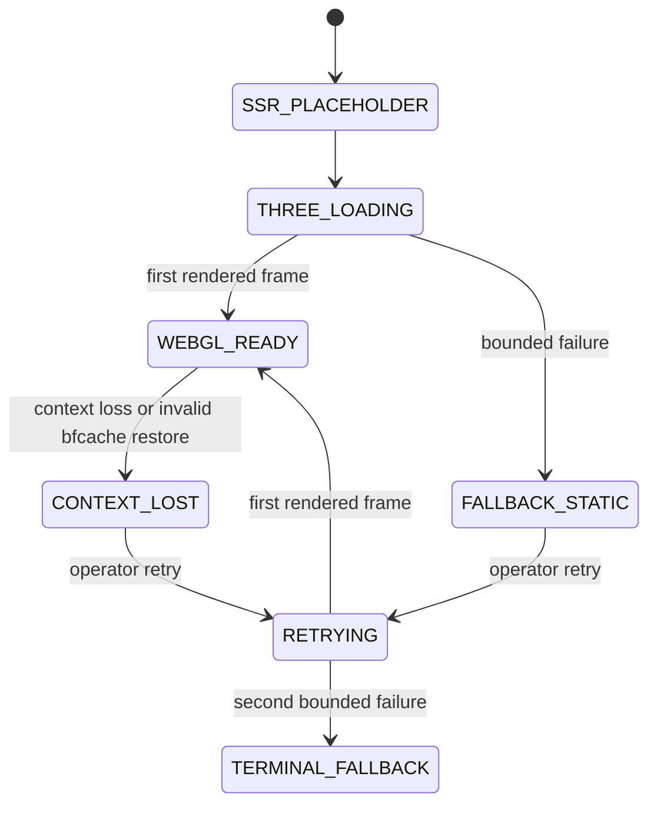

# CanopyProof WebGL Fallback Standard

## Scope

This standard governs the Global Impact Command Center Earth visualization.
The visualization is a read-only projection of independently reviewed,
one-degree regional cohorts. It never receives raw project, evidence, device,
or field coordinates.

WebGL is an enhancement, not an availability dependency. The command center
must remain readable, navigable, and privacy-preserving when the Three.js
module or GPU path is unavailable.

## Lifecycle

The retry budget is one. No automatic retry loop is permitted. The first
rendered frame, rather than module resolution or renderer construction, marks
`WEBGL_READY`.

## Failure Matrix

| Condition | Categorized code | Required result |
| --- | --- | --- |
| WebGL constructors absent | `WEBGL_UNSUPPORTED` | Static projection |
| Canvas context returns null | `CANVAS_CONTEXT_UNAVAILABLE` | Static projection |
| Three.js dynamic import rejects | `DYNAMIC_IMPORT_FAILED` | Static projection |
| Three.js chunk exceeds 3.5 seconds | `THREE_CHUNK_TIMEOUT` | Static projection; late module ignored |
| Renderer construction throws | `RENDERER_CONSTRUCTOR_FAILED` | Error-boundary static projection |
| First frame exceeds 5 seconds | `INITIAL_FRAME_TIMEOUT` | Static projection |
| `webglcontextlost` | `WEBGL_CONTEXT_LOST` | Static projection with one retry |
| Reduced-motion policy | `REDUCED_MOTION_POLICY` | Nonanimated static projection |
| Context creation throws | `GPU_PROCESS_UNAVAILABLE` | Static projection |
| Restored bfcache has lost context | `BFCACHE_CONTEXT_INVALID` | Static projection with one retry |

## Static Projection

The fallback is deterministic HTML/CSS. It uses
`buildGlobalCommandCenterEarthMarkers`, the same privacy-filtered marker
derivation as the WebGL scene.

It must:

- show only `visibility=generalized` regional cohorts;
- preserve the one-degree precision and minimum cohort policy;
- retain withheld-region counts without producing geometry;
- expose the same deterministic dashboard root;
- provide an accessible textual summary;
- state that it is a static snapshot, not a live operational claim;
- make no network request to a map or imagery provider.

The fallback must never include raw coordinates, unrestricted exception text,
project-sensitive identifiers, or device identifiers.

## Rendering Contract

The WebGL scene uses one `THREE.InstancedMesh` for all regional markers.
Creating a separate mesh per marker is prohibited. The scene uses
`frameloop="demand"`; OrbitControls interaction requests redraws without an
uncontrolled animation loop.

The viewport has a stable `h-80` mobile height and `16/7` wider-screen aspect
ratio. Loading, WebGL, context-loss, and static-fallback states retain that
footprint to prevent cumulative layout shift.

The `/dashboard/global` page uses dynamic rendering in OpenNext's Cloudflare
Node.js compatibility server function. This is required so Next.js can bind
middleware's per-request CSP nonce to its bootstrap scripts while retaining
`script-src` with `strict-dynamic`. A Next Edge runtime declaration is
prohibited because this deployment uses the supported single-Worker OpenNext
runtime contract.

## Safe Telemetry

Only these metrics are emitted through the local
`canopyproof:global-impact-webgl` event contract:

- `global_impact_webgl_ready_total`
- `global_impact_webgl_fallback_total`
- `global_impact_webgl_context_lost_total`
- `global_impact_webgl_retry_total`
- `global_impact_webgl_cold_start_ms`

An event contains exactly `metric`, `value`, `phase`, and `category`.
Cold-start values are rounded to 25 milliseconds and capped at 30 seconds.
Counters always emit `1`.

No telemetry event may contain coordinates, region or project identifiers,
device characteristics, stack traces, exception messages, or source data.
A future exporter may subscribe to the local event only if it preserves this
allowlist.

## Verification

`npm run test:webgl:browser` builds the production Next.js application and
runs Playwright against desktop and mobile Chromium. The suite covers:

1. visible nonblank canvas pixel variance;
2. one InstancedMesh marker draw;
3. stable generalized coordinates and OrbitControls redraw;
4. no-WebGL fallback and hydration integrity;
5. dynamic import failure;
6. cold chunk timeout with no late duplicate renderer;
7. context loss and bounded retry;
8. reduced motion;
9. mobile overflow and control usability;
10. absence of known raw coordinates in the DOM and request material;
11. continued withholding of unapproved regions.

Firefox and WebKit are additional compatibility targets when their pinned
browser binaries are available. Their absence must be reported as a platform
limitation, never silently treated as a pass.
