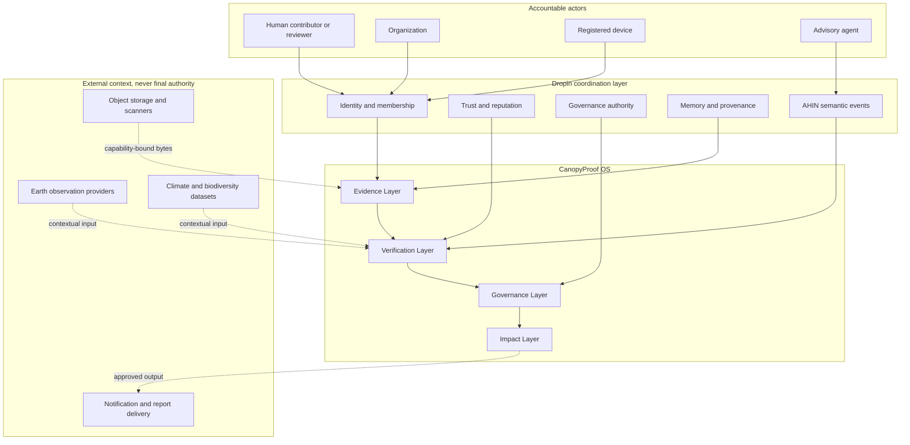

# RFC: CanopyProof OS Product System

Status: PROPOSED

Date: 2026-07-14

Decision owners: Architecture, Security, Data Governance, Earth Science,
Institutional Partnerships, Platform Operations

Local implementation authority: OPEN for default-off, non-production work
within this RFC's bounded modules and verification gates. This authority comes
from the explicit project mandate; it does not imply institutional approval.

Production activation authority: CLOSED until the applicable architecture,
security, data-governance, scientific, legal, accessibility, and platform
approvals are recorded by named humans. No approval may be inferred from code,
tests, generated documents, or an AI-authored review.

## 1. Problem Statement

CanopyProof currently combines a deployed public site, deterministic domain
services, selected append-only trust authorities, static institutional product
surfaces, and a large set of proposed integrations. That breadth can look like
a complete climate accountability platform even when important data paths are
still process-local, modeled, default-off, or absent.

The product needs one architecture that tells an operator, reviewer, partner,
and auditor:

- which system owns each fact;
- whether a value is observed, derived, reviewed, challenged, or public;
- which human or institution had authority to make a decision;
- how the decision can be independently replayed;
- what happens when providers, networks, storage, or reviewers are unavailable;
- what is explicitly not a carbon credit, tax offset, financial asset, or
  guaranteed outcome.

This RFC defines that target. It does not declare the current implementation
production-ready. Current evidence and gaps remain authoritative in
`docs/ARCHITECTURE_CURRENT_STATE.md` and
`docs/CANOPYPROOF_OS_COMPLETION_MATRIX.md`.

## 2. Goals

1. Establish four bounded product layers: Evidence, Verification, Governance,
   and Impact.
2. Define one authority and persistence boundary for every institutional fact.
3. Use Dropin identity, agent, trust, governance, memory, and AHIN primitives
   rather than duplicating them inside CanopyProof.
4. Make append-only lineage and independent replay mandatory for consequential
   mutations.
5. Keep AI advisory and require accountable human authority for final evidence,
   proof, certificate, funding, partner, and public-risk decisions.
6. Support tenant isolation, data sovereignty, offline field collection, global
   geospatial context, public transparency, and institutional exports.
7. Fail closed when identity, authority, storage, signing, lineage, or required
   human review is unavailable.
8. Provide measurable reliability, security, privacy, and governance gates
   before any production activation.

## 3. Non-Goals And Safety Boundaries

This phase does not:

- issue certified carbon credits;
- create carbon-tax offsets;
- guarantee RWA or financial yield;
- enable mainnet funds or automatic CANOPY distribution;
- handle application private keys;
- make NASA, Sentinel, Landsat, an AI model, or a community vote a proof
  authority;
- make an imagery tile equivalent to numerical source data;
- expose `/api/admin/*` publicly;
- replace institutional, scientific, legal, or local-community governance with
  software.

An Environmental Proof Record is an accountability record. Its status,
methodology, evidence, uncertainty, monitoring horizon, challenges, and
governance history must remain visible.

## 4. System Context



## 5. Layer Ownership

### 5.1 Evidence Layer

Owns immutable observations and custody facts:

- contributor, organization, device, project, location commitment, observed
  time, media commitment, consent, device attestation, provider receipt,
  metadata extraction, retention decision, offline bundle, and community
  statement;
- content-addressed references, never unrestricted object URLs or credentials;
- submitted and structurally challenged state only.

It cannot issue final verification, proof, certificates, ESG claims, funding
decisions, or public emergencies.

### 5.2 Verification Layer

Owns deterministic validation, advisory AI analyses, Earth-observation
comparisons, independent human reviews, challenges, corrections, final
evidence decisions, and current reliance projections.

AI outputs are advisory. Their records must retain model, prompt/policy,
dataset, input, output, confidence, failure mode, and provenance roots. A
separate eligible human actor makes every final decision.

### 5.3 Governance Layer

Owns identity status, organization status, membership, accreditation,
methodology publication, policy versions, conflict disclosures, approval
quorums, certificate authority, challenge resolution authority, data-sharing
agreements, and release decisions.

Governance facts are append-only. Suspension, revocation, replacement, and
appeal create new facts and never rewrite history.

### 5.4 Impact Layer

Owns read models and approved artifacts derived only from current eligible
authority:

- command-center projections;
- Environmental Proof Records and their public state;
- ESG and institutional reports;
- funding transparency views;
- early-warning alerts and response accountability.

Impact projections must preserve source roots, observation time, processing
time, freshness, verification state, uncertainty, and challenge state.

## 6. Product Module Contracts

### 6.1 Global Impact Command Center

Route: `/dashboard/global`

The command center is a read model, never an independent authority. It joins
tenant-safe project, evidence, verification, Earth-observation, funding, and
risk projections. Every metric must carry a source root and `asOf` timestamp.
Public and institutional views use separate privacy policies.

Acceptance requires real API-backed data, authenticated drill-down, source and
uncertainty disclosure, loading/empty/outage states, accessibility, and tested
large-dataset rendering. Hard-coded operational metrics are forbidden.

### 6.2 Evidence Collection Network

Route: `/mobile/report`

The client creates an encrypted local envelope with a stable evidence ID,
project root, consent, observed time, location privacy mode, media commitment,
device attestation reference, and monotonically sequenced offline operation.

Sync is an authenticated, idempotent append protocol. Conflicting ID reuse,
sequence gaps, stale project roots, or changed media commitments create review
facts; they never overwrite accepted evidence. Production offline storage must
use encrypted IndexedDB or a native secure store, not plaintext localStorage.

### 6.3 Environmental Proof Engine

Pipeline:

```text
evidence registration
  -> deterministic validation
  -> advisory AI analyses
  -> independent human review
  -> second-human final decision
  -> governed methodology and policy evaluation
  -> candidate
  -> independent approval quorum
  -> Environmental Proof Record
  -> public current/challenged/revoked projection
```

Every step binds the exact predecessor root. Missing, stale, superseded,
challenged, or cross-project facts fail closed.

### 6.4 Canopy AI Verification

The Evidence, Verification, ESG, Funding, Risk, and Community agents emit
`ASSERT`, `REASON`, `DELEGATE`, `FULFILL`, or `CHALLENGE` events. Agent identity
and capability are explicit. Agents receive least-privilege, short-lived
credentials and cannot call final-authority commands.

Production workers require leases, bounded retries, dead letters, model
registry/evaluation, drift monitoring, prompt/policy versioning, and complete
input/output lineage.

### 6.5 TerraProof Earth Intelligence

Route: `/terra`

TerraProof provides versioned geospatial context through approved connectors,
not proof. Target connectors include Sentinel, Landsat, NASA, and reviewed open
climate/biodiversity datasets. Each layer binds provider, dataset, acquisition
time, publication time where known, processing version, spatial resolution,
license, missing-data state, and source hash.

The broader spatial fabric requires an approved PostGIS/pgSTAC/object-storage/
tile architecture. The existing default-off NASA GIBS adapter remains a
visualization-context connector and cannot satisfy that gate by itself.

### 6.6 Environmental Certificate System

An Impact Certificate is a privacy-safe projection of one current
Environmental Proof Record. It includes project, bounded location, evidence
root, verification history root, methodology/policy, monitoring timeline,
contributors where disclosure is lawful, governance approvals, validity
window, and current challenge/revocation state.

Certificate signing uses an external KMS/HSM port. Application code does not
load private key bytes. Expiration, suspension, revocation, and replacement are
append-only lifecycle facts.

### 6.7 ESG Reporting Engine

Route: `/reports/esg`

Reports consume only current eligible proof and approved impact projections.
GRI, SDG, TNFD, ISSB, TCFD, UNFCCC, biodiversity, and climate mappings are
versioned adapters with methodology, scope, uncertainty, exclusions, approval,
and lineage. PDF, JSON, and API outputs share one canonical report record and
content hash.

Framework naming is not a conformance claim. Legal/methodology owners approve
each public template and jurisdiction.

### 6.8 UN And NGO Collaboration

Route: `/partners`

The partner layer supports UN agency, NGO, university, government, investor,
and restoration-organization profiles. Owner, Admin, Verifier, Researcher,
Community, and Observer roles are organization-scoped and constrained by
status, accreditation, purpose, jurisdiction, conflict, and data agreement.

Invitations, document review, suspension, revocation, expiry, appeal, governed
data access, delivery, use attestations, and accountability disclosures are
durable workflows.

### 6.9 Funding Transparency

Route: `/funding`

The layer records donor, grant, project, allocation, milestone, evidence
dependency, approval, and settlement-accountability facts. It does not move
mainnet funds. Financial execution, if ever separately authorized, must remain
outside proof authority and require independent financial controls.

### 6.10 Early Warning

Route: `/risk`

The layer ingests bounded drought, wildfire, flood, and ecosystem-degradation
signals; deduplicates and correlates them; and creates human-reviewable alerts.
Community, NGO, government, operator, and verifier delivery is policy- and
jurisdiction-aware. A model or external feed cannot automatically issue a
public emergency or funding decision.

## 7. Authority And Persistence Matrix

| Fact class | System of record | Mutation authority | Public projection |
| --- | --- | --- | --- |
| Identity and membership | PostgreSQL `identity` / `organizations` | authorized organization governance | bounded profile/status |
| Project lifecycle | PostgreSQL `projects` | organization owner/admin plus required approvals | project summary |
| Evidence and custody | PostgreSQL `evidence` plus immutable object storage | contributor/device and evidence operators | minimized evidence metadata |
| Validation and AI | PostgreSQL `verification` | deterministic worker / advisory agent | findings only when policy permits |
| Human verification | PostgreSQL `verification` | accredited independent human | current reliance state |
| Methodology and proof | PostgreSQL `governance` / `certificates` | separated approval quorum | proof record and lifecycle |
| Earth observation | PostgreSQL `satellite` plus immutable source references | approved connector operators | attributed contextual layers |
| ESG reports | PostgreSQL `reporting` | report generator plus human approval | approved versioned artifact |
| Funding transparency | PostgreSQL `funding` | bounded finance/governance roles | accountability ledger |
| Risk alerts | PostgreSQL `impact` / risk domain | policy plus accountable humans | privacy-safe alert/status |
| Audit | PostgreSQL `audit` plus external immutable checkpoints | database/domain appenders | hash-only verification |

Process-local maps, browser localStorage, static TypeScript module data, model
memory, map tiles, and external provider responses are never systems of record.

## 8. API Boundary

All institutional APIs use one versioned CanopyProof namespace and resource
model. Existing `/canopyproof/*` routes remain the compatibility baseline until
an explicit versioning ADR decides whether `/api/v1/canopyproof/*` is exposed at
the edge. Namespace migration cannot silently create duplicate authorities.

Mutations require:

- origin-verified identity assertion;
- current durable participant, organization, membership, role, accreditation,
  conflict, and policy checks as applicable;
- organization and project scope;
- idempotency key and canonical command hash;
- exact expected predecessor root;
- one serializable transaction containing fact, semantic event, database audit,
  and replayable receipt;
- structured error codes with no sensitive payload leakage.

Reads require explicit public, observer, institutional, reviewer, or operator
views. Public reads never expose precise protected locations, private contact,
raw evidence, object capabilities, credentials, or internal abuse signals.

## 9. Database And Data Sovereignty

Canonical PostgreSQL schemas are `identity`, `organizations`, `projects`,
`evidence`, `verification`, `certificates`, `satellite`, `impact`, `funding`,
`governance`, `reporting`, and `audit`.

Required properties:

- append-only authority facts and semantic events;
- immutable command receipts and deterministic replay;
- tenant RLS and FORCE RLS under non-owner application roles;
- least-privilege writers per bounded context;
- explicit regional residency and cross-border transfer policy;
- encrypted storage and transport with external key lifecycle;
- retention, legal hold, minimization, tombstone, and deletion-proof lineage;
- independently exported audit checkpoints;
- no coordinates or personal data duplicated into generic audit rows.

Large media, raster, point-cloud, and report bytes live in immutable object
storage. PostgreSQL stores commitments, metadata, policy, and capability-safe
references.

## 10. Threat Model

The system must detect, prevent, or fail closed for:

- fabricated, duplicated, replayed, or staged evidence;
- GPS/clock/device spoofing and compromised field clients;
- malicious media, decompression bombs, parser exploits, and model poisoning;
- cross-tenant reads/writes and stale membership/accreditation;
- colluding contributors, reviewers, organizations, or agents;
- AI self-approval and hidden model substitution;
- stale or contradictory satellite/context data;
- audit deletion, reordering, predecessor forks, or receipt substitution;
- report/certificate proof laundering and unsafe public claims;
- arbitrary upstream URLs, SSRF, credential leakage, and dependency compromise;
- queue duplication, lease loss, poison jobs, and retry storms;
- database, object-store, provider, API, region, and notification outages;
- governance capture, undisclosed conflicts, and authority revocation delay.

Detailed controls remain in `docs/SECURITY.md`,
`docs/SECURITY_TRUST_LAYER.md`, `docs/SPATIAL_THREAT_MODEL.md`,
`docs/VISUAL_EVIDENCE_THREAT_MODEL.md`, and
`docs/NASA_GIBS_THREAT_MODEL.md`.

## 11. Reliability And Scale

Initial service objectives are design targets, not current claims:

| Surface | Availability target | Correctness/freshness target |
| --- | --- | --- |
| Public records | 99.95% monthly | current projection lag under 5 minutes |
| Institutional reads | 99.9% monthly | source-root and `asOf` on every response |
| Evidence intake | 99.9% monthly | acknowledged writes durable before success |
| Verification queue | 99.9% monthly | no silent loss; bounded retry and DLQ |
| Audit verification | 99.99% monthly | exact deterministic replay |
| External connectors | provider-dependent | explicit stale/outage state; never fabricated freshness |

The architecture must support horizontal API replicas without process-local
authority, partitioned asynchronous work, object-store lifecycle, bounded
geospatial queries, backpressure, regional failover, restore exercises, and
capacity models for media/raster/point-cloud workloads.

## 12. Observability

Every request and command carries trace, request, actor, organization, project,
command, and audit-event identifiers where disclosure is safe. OpenTelemetry
spans cover edge proxy, web/server function, API, database transaction, queue,
worker, external connector, object storage, and delivery.

Metrics must include latency, errors, saturation, queue depth/age, retries,
dead letters, connector freshness/outage, verification backlog, challenge age,
audit replay failure, RLS denial, object quarantine, report publication, and
unsafe-claim rejection. Cardinality is bounded; raw IDs and personal data do
not become metric labels.

## 13. Verification Gates

No module is complete based only on a route, type, schema, or unit test.
Required evidence includes:

1. unit and property tests for deterministic rules;
2. native PostgreSQL non-owner RLS, transaction, idempotency, and concurrency;
3. integration tests for storage, scanner, queue, signer, provider, and delivery
   adapters;
4. security tests for every threat class and parser boundary;
5. browser E2E for authenticated roles, offline recovery, accessibility, and
   privacy-safe public views;
6. chaos tests for database, queue, object storage, API, connector, and regional
   failure;
7. measured line and branch coverage with an enforced threshold; test counts
   are not coverage evidence;
8. load, soak, restore, and disaster-recovery evidence against declared SLOs;
9. independent architecture, security, data-governance, scientific,
   accessibility, legal, and operations approval where applicable.

## 14. Migration And Rollout

1. Freeze a clean, reproducible Git baseline and activate root pull-request CI.
2. Convert SQL design files into ordered, idempotent, reviewed migrations with
   least-privilege roles and rollback/read-only procedures.
3. Run native PostgreSQL gates before exposing authority routes.
4. Introduce external adapters behind default-off feature flags and controlled
   egress; never accept arbitrary endpoints.
5. Dual-read only for comparison. Canonical writes have one authority and never
   fan out to two independent systems of record.
6. Backfill hashes and lineage from eligible legacy rows without fabricating
   missing provenance. Quarantine ineligible rows.
7. Enable one tenant and one bounded workflow in non-production, then expand by
   explicit approval and observed SLO/security evidence.
8. Replace static UI data only after the canonical read projection is available.
9. Production deployment remains a separate human-approved release action.

## 15. Rollback

- Close routes and feature flags before changing storage behavior.
- Preserve all authority facts, audit events, receipts, challenge history, and
  migration boundary roots.
- Keep affected records readable with explicit unavailable/stale/non-reliance
  state.
- Resume from the last independently verified root; never reset sequence or
  overwrite history.
- Revoke capabilities and signer keys through append-only lifecycle facts.
- Do not roll back by enabling memory fallbacks, development headers, unsafe
  claims, admin proxy access, or automated final authority.

## 16. Phase 1 Entry And Exit Gates

Local implementation entry gates:

- Phase 0 review is current and validated.
- This RFC defines the authority, persistence, security, verification, and
  rollback boundary for the selected slice.
- The repository baseline and ownership of the selected slice are explicit.

Production activation entry gates:

- named architecture, security, data-governance, scientific, accessibility,
  legal, and platform approval is recorded where applicable;
- all selected-slice verification evidence is independently reviewable;
- feature flags, routes, credentials, data residency, retention, incident
  response, and rollback ownership are approved for the target environment.

Exit gates:

- all ten product modules have approved authority/read-model contracts;
- the first production vertical slice uses durable identity, evidence,
  verification, audit, and governance boundaries end to end;
- no institutional page displays hard-coded facts as live data;
- native database, external adapter, security, browser, chaos, coverage, and
  observability evidence meet the selected slice's acceptance criteria;
- `docs/CANOPYPROOF_OS_COMPLETION_MATRIX.md` is re-audited without converting
  partial or unproven evidence into a completion claim.

## 17. First Implementation Slice

The first slice is **Evidence Intake Control Plane**, not a new UI.

Scope:

- clean repository and root PR gate;
- native PostgreSQL execution for identity/project/evidence/custody authority;
- approved object-storage upload-grant signer and stored-object receipt
  verifier behind a default-off adapter;
- scanner/quarantine receipt integration;
- encrypted offline envelope and authenticated idempotent sync protocol;
- human review queue handoff with no final-proof authority;
- traces, metrics, abuse controls, retention/minimization, and recovery tests.

The existing `/mobile/report` localStorage prototype remains non-production and
must not be promoted. Route activation is a later decision after native,
privacy, provider, security, accessibility, and operational gates pass.

The object-storage and malware-scanner bridge is specified in
`docs/RFC_EVIDENCE_MEDIA_INTAKE_ADAPTERS.md`. Its receipt validators,
public-key-only scanner verification, disabled adapters, and non-production
legacy-route gate may be implemented locally. A provider port, bucket-lock
attestation, scanner service, durable command integration, or route activation
still requires the migration and production gates in that RFC.

## 18. Open Decisions

1. Root open-source license, notice, trademark, contribution, security, and
   maintainer governance require authorized human/legal decisions.
2. Data residency regions and cross-border transfer policy require partner and
   privacy review.
3. Canonical API versioning requires an ADR before namespace migration.
4. Object-storage provider, KMS/HSM, malware scanner, queue, and device-
   attestation vendors require procurement and threat review.
5. TerraProof spatial stack remains gated by `docs/ADR_SPATIAL_STACK.md`.
6. SLO error budgets and on-call ownership require Platform Operations
   approval.

No approval is inferred from the existence of this RFC.
