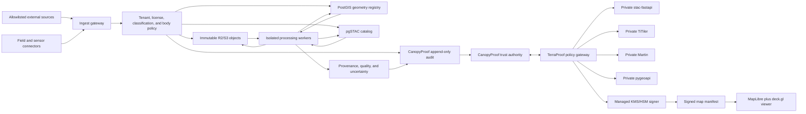

# RFC: TerraProof Spatial Fabric P0

Status: PROPOSED - implementation prohibited pending ADR approval

Date: 2026-07-12

Owners: CanopyProof Architecture, Security, Data Governance, and Earth Science

Related decision: `docs/ADR_SPATIAL_STACK.md`

## 1. Problem Statement

CanopyProof needs spatial evidence that is discoverable, reproducible,
tenant-safe, and suitable for institutional scrutiny. The current TerraProof
prototype models useful satellite and climate concepts but stores its state in
process memory and exposes static layer metadata. It cannot yet provide durable
geometry, immutable binary assets, catalog-scale discovery, reproducible
processing lineage, uncertainty accounting, or a safe public map contract.

A generic GIS portal would not solve the trust problem. It could display maps
while leaving unresolved who supplied an observation, which license permits its
use, what processing produced a metric, whether the geometry changed, and who
reviewed the result. The P0 spatial fabric therefore treats maps as bounded
projections of a governed evidence system, not as proof authority.

## 2. Authority Model

### 2.1 CanopyProof Authority

CanopyProof remains authoritative for:

- organizations and identities;
- projects and memberships;
- evidence and evidence lifecycle;
- verification and human review;
- certificates and public proof records;
- challenges, corrections, and non-reliance notices;
- governance and funding decisions;
- ESG reports and reportable metrics;
- append-only audit events.

### 2.2 TerraProof Authority

TerraProof is authoritative only for:

- spatial asset metadata and registered object identity;
- observation and acquisition provenance;
- approved processing recipe definitions;
- processing run records and derived spatial products;
- authoritative geometry references and spatial relationships;
- spatial quality assessments and uncertainty budgets;
- disclosure-safe spatial views and signed map manifests.

### 2.3 External System Authority

External GIS, sensor, field, biodiversity, and imagery systems provide
untrusted inputs or compatibility surfaces. They cannot:

- approve evidence or their own derived outputs;
- issue a CanopyProof certificate;
- satisfy human-review requirements;
- mutate CanopyProof audit history;
- become the final source for an ESG assertion;
- bypass tenant, license, classification, or disclosure policy.

## 3. Goals And Non-Goals

### Goals

- Establish a durable, multi-tenant spatial metadata and geometry authority.
- Keep large binaries immutable and outside PostgreSQL.
- Support interoperable raster, vector, multidimensional, tile, offline, and
  point-cloud formats.
- Make every derived product reproducible from immutable inputs and an approved
  recipe version.
- Expose public maps through a signed, expiring, read-only manifest containing
  no credentials and no arbitrary URLs.
- Enforce license, classification, provenance, quality, uncertainty, and
  disclosure policy before institutional use or export.
- Map spatial provenance into CanopyProof audit semantics, W3C PROV,
  OpenLineage, and AHIN events.
- Fail closed for non-Earth assets in production.

### Non-Goals

- Building a general-purpose desktop GIS or replacing institutional GIS tools.
- Allowing browsers to query PostGIS, pgSTAC, R2, or processing services
  directly.
- Storing raster, point-cloud, video, or large vector binaries in PostgreSQL.
- Treating STAC, PMTiles, GeoParquet, or an external catalog as transactional
  proof storage.
- Allowing AI or a processing service to approve its own result.
- Supporting Moon or Mars assets in production unless a separately isolated
  `PLANETARY_LAB=true` environment is explicitly enabled.

## 4. Architectural Constraints

1. Every record is tenant- and organization-scoped. Project scope is required
   for project data and optional only for approved shared reference datasets.
2. Production `bodyId` is exactly `earth`. Unknown bodies and non-Earth bodies
   fail closed before ingest, query, processing, disclosure, and reporting.
3. The gateway resolves opaque asset IDs to allowlisted object locations.
   Clients and service callers cannot submit arbitrary remote URLs.
4. All service tokens are short-lived, audience-bound, purpose-bound, and
   scoped to tenant, project, classification, and operation.
5. Raw private keys never enter source control, browser code, application
   configuration, logs, or map manifests.
6. Immutable object versions and checksums are assigned before catalog
   publication. Mutation produces a new asset or product version.
7. All institutional outputs require complete provenance, approved
   methodology, explicit quality, and an uncertainty budget.
8. AI output is advisory and cannot issue certificates or satisfy final human
   review.

## 5. Proposed P0 Topology



All spatial services are private origins. Only the CanopyProof gateway and
explicitly public, bounded tile endpoints are reachable from the web edge.

## 6. P0 Domain Contracts

The following are design contracts, not implemented models.

### 6.1 Shared Record Envelope

Every TerraProof entity carries:

| Field | Contract |
| --- | --- |
| `id` | Stable opaque identifier; never derived from a mutable display name. |
| `tenantId` | Required authorization and row-isolation boundary. |
| `organizationId` | Owning or steward organization. |
| `projectId` | Required for project data; null only for approved shared reference collections. |
| `bodyId` | `earth` in production; non-Earth values rejected unless isolated planetary lab mode is active. |
| `classification` | `PUBLIC`, `INTERNAL`, `RESTRICTED`, or `HIGHLY_RESTRICTED`. |
| `retentionPolicy` | Versioned policy identifier, not free-form duration text. |
| `auditEventId` | CanopyProof audit event that created the current immutable version. |
| `createdAt` | Server-issued UTC timestamp. |
| `createdBy` | Verified human, service, device, or agent identity. |
| `version` | Monotonic entity version. Mutation creates a new version or new entity. |

Across the entity-specific schemas, the required field vocabulary is:
`tenantId`, `organizationId`, `projectId`, `bodyId`, `sourceType`, `uri`,
`checksum`, `provider`, `dataset`, `licensePolicy`, `acquiredAt`, `ingestedAt`,
`crs`, `resolution`, `bbox`, `cloudCover`, `processingVersion`,
`classification`, `retentionPolicy`, `provenanceRoot`, `qualityScore`,
`uncertainty`, and `auditEventId`. A schema may represent `licensePolicy` or
`uncertainty` as a typed reference rather than embedding the complete object.
`qualityScore` is a display/index summary and cannot override a failed quality
gate or substitute for the full `SpatialQualityAssessment`.

### 6.2 SpatialAsset

Represents one immutable registered object or externally referenced immutable
resource.

Required fields:

- shared record envelope;
- `sourceType`, `provider`, and `dataset`;
- opaque `objectRef` or approved external registry reference;
- canonical `uri` held only in the private registry, never accepted from a
  public request;
- `checksumAlgorithm`, `checksum`, `sizeBytes`, and media type;
- `licensePolicyId`;
- `acquiredAt` and `ingestedAt`;
- `crs`, `resolution`, `bbox`, and optional temporal extent;
- `cloudCover` where applicable;
- `provenanceRoot`, quality state, and uncertainty reference;
- object version and immutability state.

### 6.3 SpatialCollection

Groups compatible assets under a provider/dataset, license, extent, and quality
policy. It maps to a STAC Collection where appropriate but retains CanopyProof
tenant and governance fields.

### 6.4 SpatialScene

Represents one bounded acquisition or observation scene. A scene references
immutable assets and acquisition provenance; it does not duplicate their
binaries. It records provider identifiers, time, geometry, resolution, cloud
cover, missing-data flags, and quality status.

### 6.5 SpatialLayer

Defines a governed presentation or analytical layer over one or more
collections/products. A layer contains styling and disclosure policy references
but no credentials or arbitrary source URL.

### 6.6 ProcessingRecipe

An immutable, reviewable recipe definition containing:

- `recipeId`, semantic version, methodology ID, and methodology version;
- ordered operations and canonical parameters;
- expected input/output media types, CRS, resolution, and dimensional schema;
- pinned software packages, container digest, and execution constraints;
- quality gates and uncertainty propagation method;
- approving human reviewer and governance state;
- deprecation and replacement references.

### 6.7 ProcessingRun

An immutable execution record containing the recipe version, input assets and
hashes, parameters, software/container digests, execution environment,
`startedAt`, `completedAt`, actor, agent event, human-review state, output hashes,
status, logs reference, and audit event.

### 6.8 DerivedProduct

An immutable output that references its processing run, output assets,
authoritative geometry, provenance root, quality assessment, uncertainty
budget, and review state. A product is not institutionally reportable until all
gates pass.

### 6.9 SpatialProvenanceEdge

A content-addressed directed edge from an input entity to an output entity. It
records relation type, hashes, operation, actor, run, timestamp, and audit event.
Edges are append-only and form an acyclic derivation graph for each product.

### 6.10 SpatialLicensePolicy

A versioned machine-evaluable policy covering access, attribution,
redistribution, derivatives, commercial use, geographic restrictions,
expiration, export, and public-display conditions. Missing or ambiguous license
terms block institutional use.

### 6.11 SpatialQualityAssessment

A versioned assessment containing checks, measurements, flags, assessor,
methodology, timestamps, and pass/fail state for CRS, geometry, completeness,
coverage, cloud, resolution, temporal fitness, and sensor-specific quality.

### 6.12 UncertaintyBudget

Records each uncertainty component, units, distribution or interval, source,
correlation assumptions, propagation method, aggregate confidence interval,
reviewer, and methodology version. A scalar quality score cannot replace this
budget.

### 6.13 SpatialDisclosureView

An immutable policy result describing exactly which geometry, precision,
attributes, assets, time ranges, and styles may be disclosed to an audience.
Sensitive coordinates are generalized before the view is created.

### 6.14 SignedMapManifest

A versioned, tenant- and project-scoped read model containing only allowlisted
layers and opaque tile/resource handles. It includes issue/expiry times,
audience, nonce, policy version, manifest checksum, signing key ID, and
signature. It contains no database credentials, storage credentials, bearer
tokens, raw private locations, or unrestricted URLs.

## 7. Storage Contracts

### 7.1 PostgreSQL And PostGIS

PostGIS stores authoritative geometry and relationships:

- geometry version, CRS, validity result, bounding envelope, and spatial index;
- project/asset/product relationships;
- disclosure-generalized geometry as a separate derived view;
- tenant and organization keys on every row;
- immutable version rows, not in-place history loss;
- row-level security as defense in depth, in addition to application policy.

It must not store large binary assets.

### 7.2 pgSTAC

pgSTAC stores STAC discovery documents and search indexes. Its catalog records
reference TerraProof IDs and immutable object versions. pgSTAC does not replace
CanopyProof audit or TerraProof provenance. Any catalog replacement is preceded
by a new immutable TerraProof version and audit event.

### 7.3 R2/S3-Compatible Object Storage

Object storage holds immutable binaries and processing logs using:

- content checksum and size verification before registration;
- bucket/prefix isolation by environment and classification;
- versioning or write-once policy for authoritative inputs and outputs;
- deny-by-default direct access;
- short-lived, object-specific delivery only after gateway authorization;
- lifecycle policy bound to retention and legal-hold state.

### 7.4 Format Roles

| Format | P0 role |
| --- | --- |
| COG | Immutable raster source and delivery. |
| Zarr | Chunked multidimensional datacube. |
| GeoParquet / GeoArrow | Analytical exchange and bounded columnar execution. |
| PMTiles | Immutable public snapshot, never transactional state. |
| GeoPackage | Versioned offline field or institutional exchange package. |
| COPC / EPT | Point-cloud delivery and indexing. |

## 8. Service Boundary Contract

Each call to stac-fastapi, TiTiler, Martin, pygeoapi, or a processing worker must
carry a verified service envelope:

```json
{
  "subject": "service-or-user-id",
  "audience": "terraproof-service-id",
  "tenantId": "tenant-id",
  "organizationId": "organization-id",
  "projectId": "project-id",
  "purpose": "VIEW_PUBLIC_MAP",
  "classificationCeiling": "PUBLIC",
  "licenseDecisionId": "decision-id",
  "correlationId": "audit-correlation-id",
  "issuedAt": "RFC3339 timestamp",
  "expiresAt": "RFC3339 timestamp"
}
```

Tokens must be signed, short-lived, non-forwardable where supported, and
validated for issuer, audience, time, purpose, tenant, project, and operation.
The service receives a registry asset ID; only the gateway-side registry may
resolve it to an allowlisted object URI.

## 9. Public Map Manifest API

Proposed endpoint:

```text
GET /canopyproof/terra/projects/:projectId/map-manifest
```

Request policy:

- authenticate for non-public views;
- resolve tenant and project from verified identity and route binding;
- evaluate classification, license, retention, body, and disclosure policy;
- reject missing, expired, challenged, or non-Earth inputs;
- append or correlate a read/audit event according to policy.

Response properties:

- signed and versioned;
- short expiry and audience binding;
- tenant- and project-scoped;
- read-only and credential-free;
- limited to allowlisted assets and styles;
- coordinates generalized when disclosure policy requires it;
- stable cache key includes manifest version and disclosure policy version.

Signing uses a managed KMS/HSM boundary. The gateway submits a canonical
manifest digest and receives a signature. Raw signing keys are never available
to application code or developers. Verification keys may be published with key
IDs and rotation windows.

## 10. Provenance And Audit Mapping

Every derived product records:

- input asset IDs and hashes;
- operation and canonical parameters;
- software names, versions, and immutable image digests;
- execution environment and resource profile;
- start and completion times;
- output asset IDs and hashes;
- actor, service identity, and agent event;
- human-review state and reviewer;
- CanopyProof audit event.

Concept mapping:

| TerraProof | W3C PROV | OpenLineage | AHIN |
| --- | --- | --- | --- |
| SpatialAsset / DerivedProduct | Entity | Dataset | `ASSERT` target |
| ProcessingRecipe | Plan | Job definition | `REASON` basis |
| ProcessingRun | Activity | Run | `FULFILL` event |
| Human or service identity | Agent | Run facet/producer | `DELEGATE` actor |
| Provenance edge | wasDerivedFrom / used / wasGeneratedBy | input/output dataset event | linked `ASSERT` / `REASON` |
| Review or dispute | qualified association / invalidation note | custom facet/event | `CHALLENGE` |

Interchange mappings do not replace the CanopyProof append-only audit record.

## 11. Institutional Use Gates

An asset or product is blocked from institutional use when any of the following
is true:

- license is missing, expired, ambiguous, or disallows the intended purpose;
- provenance is incomplete or a checksum cannot be verified;
- CRS is unknown, invalid, or unsupported;
- geometry is invalid or outside the registered body/domain;
- cloud cover exceeds the methodology policy;
- resolution is unsupported for the claimed metric;
- asset retention or validity has expired;
- tenant, organization, or project scope does not match;
- sensitive location would be exposed;
- methodology or processing recipe is unapproved;
- human review is missing where the methodology requires it;
- product is challenged, withdrawn, or superseded.

Every reportable metric must reference:

- `methodologyId` and `methodologyVersion`;
- source asset references and hashes;
- processing run references;
- verification references;
- confidence interval and uncertainty budget;
- accountable human reviewer.

## 12. Viewer Boundary

P0 uses MapLibre GL JS plus deck.gl. The viewer:

- consumes only a verified map manifest;
- does not accept arbitrary layer URLs or user-authored executable styles;
- uses one camera and one interaction state;
- fetches only visible, authorized tiles/columns;
- shows quality, currency, provenance, and uncertainty status;
- distinguishes observations, derived products, and verified proof records;
- never presents a map color or AI score as certification.

GeoLibre is not embedded in P0. It may become a separate P1 expert workbench
with stronger authentication, export controls, and audit policy.

## 13. Migration Strategy

After ADR approval, migration proceeds without relabeling prototype state:

1. Freeze and export the current hardcoded layer catalog as non-authoritative
   fixtures.
2. Introduce schemas and policy contracts behind disabled feature flags.
3. Register approved reference collections and immutable sample assets in a
   non-production environment.
4. Dual-read prototype and new registry for comparison; all institutional
   responses continue using the existing bounded path until acceptance.
5. Backfill scenes only when source hashes, licenses, acquisition metadata, and
   tenant ownership are independently available. Otherwise retain them as test
   fixtures.
6. Enable internal manifest generation for one tenant/project and audit every
   decision.
7. Complete security, governance, science, load, and disaster-recovery gates.
8. Switch read paths by project allowlist. Do not auto-migrate writes.
9. Remove the in-memory authority only after rollback windows close.

No production deployment is part of this RFC.

## 14. Rollback Strategy

- Disable the new spatial feature flags and manifest route.
- Revoke service audiences and manifest signing key IDs without deleting audit
  history.
- Stop processing queues while preserving immutable objects and run records.
- Restore database schemas from point-in-time recovery only for operational
  corruption; never erase valid audit/provenance events to simulate rollback.
- Continue serving existing non-spatial CanopyProof trust functions.
- Mark affected manifests and derived products withdrawn or superseded through
  append-only records.
- Preserve object versions under legal hold until the incident review permits
  lifecycle deletion.

Rollback cannot make the current process-memory prototype a production proof
authority.

## 15. Observability And Reliability Requirements

Before production consideration, measure:

- catalog query latency and rejected cross-tenant queries;
- tile latency, cache hit ratio, range bytes, and origin amplification;
- object checksum failures and immutability violations;
- processing queue age, retry count, deterministic replay result, and resource
  consumption by recipe;
- provenance completeness and uncertainty-policy failure counts;
- manifest issue, verify, expire, replay, and rejection counts;
- license and sensitive-location policy decisions;
- database connection saturation, index health, replica lag, backup restore,
  and recovery objectives.

Logs must use opaque IDs, correlation IDs, and policy decisions. They must not
contain credentials, raw restricted coordinates, signed URLs, or sensitive
payloads.

## 16. Open Decisions

- Managed PostGIS/pgSTAC provider and regional residency model.
- KMS/HSM signer and public verification-key distribution.
- Exact STAC extensions and version support.
- Object-lock and legal-hold capabilities of the selected object store.
- Institutional OGC API profiles required by launch partners.
- Approved Earth CRS set and antimeridian/polar geometry policy.
- Quantitative disclosure thresholds for sensitive species and communities.
- Per-recipe quality and uncertainty acceptance thresholds.

## 17. Approval Gate

This RFC authorizes no implementation. The following approvals must be recorded
in `docs/ADR_SPATIAL_STACK.md` before code, dependencies, migrations, routes,
services, or infrastructure are added:

- Principal Architecture;
- Security;
- Data Governance and Licensing;
- Earth Science / MRV Methodology;
- Platform Operations.
