# RFC: CanopyProof Visual Evidence Intelligence

Status: IMPLEMENTATION BASELINE - non-production only; deployment gate closed

Date: 2026-07-13

Owners: CanopyProof Architecture, Trust, Security, Data Governance, and Earth Science

Related decisions:

- `docs/RFC_TRUST_LAYER.md`
- `docs/EVIDENCE_PROTOCOL.md`
- `docs/RFC_TERRAPROOF_SPATIAL_FABRIC.md`
- `docs/ADR_SPATIAL_STACK.md`
- `docs/FIFTYONE_INTEGRATION_POLICY.md`
- `docs/VISUAL_EVIDENCE_THREAT_MODEL.md`
- `docs/POINT_CLOUD_MRV_STANDARD.md`
- `docs/VISUAL_DATA_LICENSE_POLICY.md`

## 1. Decision Summary

CanopyProof will add a Visual Evidence Intelligence bounded context between
TerraProof spatial products and the CanopyProof Trust Kernel. The context
registers immutable visual assets, model runs, candidate findings, review queue
snapshots, human review decisions, field checks, and bounded visual findings.

The system makes three distinctions non-negotiable:

1. A model output is a candidate, not evidence and not truth.
2. A FiftyOne label, saved view, panel action, or annotation is workbench state,
   not an authoritative CanopyProof record.
3. A human-reviewed `VisualFinding` is still a bounded observation. It cannot
   issue a certificate, publish an ESG metric, approve funding, or become an
   Environmental Proof Record without the existing Trust Kernel and governance
   gates.

FiftyOne may be deployed only as an isolated, internal, disposable review
workbench. CanopyProof persists all authoritative snapshots and decisions.

This RFC now exists as the required design baseline. Pure domain contracts,
durable-adapter contracts, API contracts, isolated fixtures, and tests may be
implemented in non-production. Institutional data access, a live FiftyOne
service, public routes, and deployment remain closed until the review record in
Section 24 is complete. The TerraProof spatial stack remains separately blocked
while `docs/ADR_SPATIAL_STACK.md` is `PROPOSED` with its implementation gate
`CLOSED`; this RFC cannot open that gate.

## 2. Problem Statement

CanopyProof receives imagery, video, thermal frames, orthophotos, and point
clouds that are too large and too ambiguous for an unaided reviewer to inspect
reliably. Embeddings, similarity search, detectors, rules, and point-cloud
derivatives can reduce the review burden. They can also manufacture false
confidence if their candidates, mutable views, or labels are mistaken for
verified evidence.

The current repository contains:

- a durable Trust Kernel for identity, evidence, audit, verification, proof,
  challenge, and governance semantics;
- a proposed TerraProof spatial architecture whose implementation gate is
  still closed;
- an in-process Terra intelligence prototype based on mutable `Map` objects;
- no authoritative visual dataset, candidate, review-queue, field-check,
  hard-negative, sensor-domain, or FiftyOne adapter contracts.

The in-process prototype is not suitable as production authority. It cannot be
used to bypass durable tenant isolation, immutable object registration,
provenance, license evaluation, or audit transactions.

The required layer must therefore accelerate review while preserving the
institutional question: what was observed, by which sensor, under which rights,
using which immutable inputs and model, reviewed by whom, with what uncertainty,
and under which final authority?

## 3. Phase 0 Due-Diligence Findings

### 3.1 FiftyOne

The evaluated open-source core is Apache-2.0 licensed and supports image,
video, 3D scene, point-cloud, and grouped datasets. Its 3D tooling supports PCD
point clouds and dynamic coloring from point attributes. FiftyOne Brain
supports embeddings, visualization, and similarity indexes. Datasets may be
persistent, while source media remains external to the dataset database.

FiftyOne views are query rules over a dataset. A view, including a saved view,
may produce different membership after the underlying dataset changes. This is
the direct reason CanopyProof must freeze queue membership and hashes in its own
authority.

Plugins can contain Python or JavaScript operators, install dependencies,
access configured secrets, alter datasets, write files, export media, and run
delegated background operations. Open-source plugin installation can download
code from GitHub. These are capabilities, not a sandbox guarantee. CanopyProof
must treat every plugin as privileged code and permit only a pinned internal
plugin with a narrow API client.

FiftyOne uses MongoDB for dataset metadata and can use its bundled database or
a self-managed MongoDB deployment. Its database and saved views are review
indexes only. They are rebuildable and never authoritative for identity,
license, evidence, review, audit, or proof state.

Official references:

- [FiftyOne repository and Apache-2.0 license](https://github.com/voxel51/fiftyone)
- [FiftyOne datasets, persistence, and point-cloud media](https://docs.voxel51.com/user_guide/using_datasets.html)
- [Dataset views and saved-view drift](https://docs.voxel51.com/user_guide/using_views.html)
- [FiftyOne Brain embeddings and similarity](https://docs.voxel51.com/brain.html)
- [FiftyOne App and 3D visualizer](https://docs.voxel51.com/user_guide/app.html)
- [Plugin installation and operators](https://docs.voxel51.com/plugins/using_plugins.html)
- [Plugin and operator development](https://docs.voxel51.com/plugins/developing_plugins.html)
- [FiftyOne configuration and MongoDB](https://docs.voxel51.com/user_guide/config.html)
- [Docker and self-hosting environments](https://docs.voxel51.com/installation/environments.html)
- [Annotation integrations](https://docs.voxel51.com/integrations/index.html)

### 3.2 VineLiDAR

The original Zenodo release contains ten high-density LAZ point clouds with
embedded RGB, acquired over two vineyard blocks during three acquisition dates
in 2021 and 2022. Flights used 20 m, 30 m, and 50 m above-ground altitudes. The
release is CC BY 4.0 and requires attribution.

The Voxel51 preparation exposes downsampled PCD review copies. Its 2021 assets
use local or relative coordinates without an EPSG identifier, while the 2022
assets use EPSG:32629. PCD files are recentered and preserve offsets as
metadata. These frames are not directly comparable without an explicit
registration transform and residual-error assessment.

The dataset has no hand-authored detection or segmentation ground truth. The
source description's phrase "ground truth" concerns the possible use of dense
UAV LiDAR to validate coarser satellite products; it must not be represented as
object-level annotation truth or CanopyProof evidence.

The full-resolution LAZ files are authoritative source artifacts for this lab
dataset. Downsampled PCD files are review projections only.

Official references:

- [VineLiDAR Voxel51 dataset card](https://huggingface.co/datasets/Voxel51/VineLiDAR)
- [Original VineLiDAR Zenodo record and CC BY 4.0 rights](https://zenodo.org/records/8113105)
- [Original dataset article](https://www.sciencedirect.com/science/article/pii/S2352340923007655)

### 3.3 Ariel Scans

The Voxel51 dataset card describes 6,546 frames: approximately 3,274 RGB frames
at 4624 by 3472 and 3,272 thermal/IR frames at 640 by 512, paired tile-for-tile.
The analysis includes CLIP embeddings, similarity and UMAP runs, machine
candidate detections, geometry scores, patch embeddings, uniqueness, and ten
saved views.

The `plane_candidates` records are unverified, machine-generated hypotheses.
Most are bushes, rocks, and shadows. Image `0000` contains a field-checked
shadow false positive and is a useful known decoy. RGB and thermal frames have
material resolution, contrast, and noise differences and must not share a model
or threshold without domain validation.

The dataset card gives MIT terms for code and annotations but describes the
imagery only as courtesy of the original poster. That is not adequate evidence
of institutional redistribution, public export, or model-training rights.
CanopyProof therefore fails closed on the imagery unless legal review records
explicit rights.

Official reference:

- [Voxel51 Ariel Scans dataset card](https://huggingface.co/datasets/Voxel51/ariel_scans)

## 4. Authority Model

| Authority | Owns | Explicitly does not own |
| --- | --- | --- |
| CanopyProof Trust Kernel | organizations, identities, projects, canonical evidence, verification, proof records, certificates, challenges, governance, ESG reports, funding decisions, append-only audit | spatial processing products or workbench state |
| TerraProof | immutable spatial assets, acquisitions, recipes, runs, derived spatial products, spatial provenance, quality, uncertainty, disclosure-safe spatial views | final evidence, proof, certificate, ESG claim, or funding decision |
| Visual Evidence Intelligence | visual dataset snapshots, models, runs, embeddings, candidates, frozen review queues, review decisions, field tasks/results, hard negatives, decoys, sensor-domain assessments, bounded visual findings, visual provenance | raw spatial authority, final evidence decision, certificate, ESG metric, or funding release |
| FiftyOne | temporary internal review dataset, visualization, saved queries, embeddings exploration, model evaluation, operator UI | any authoritative CanopyProof or TerraProof state |
| External model/annotation provider | provider result and provider receipt | CanopyProof identity, review, audit, evidence, or proof authority |

No synchronization direction changes these boundaries. Importing a workbench
decision creates a new CanopyProof command subject to policy and audit; it does
not copy authority from FiftyOne.

## 5. Goals

- Reduce human review volume without treating ranking as truth.
- Bind every candidate and finding to immutable assets, model definitions,
  model runs, sensor domains, recipes, and provenance roots.
- Preserve rejected candidates as hard negatives or known decoys.
- Freeze review queue membership so a mutable dataset or saved view cannot
  rewrite historical review scope.
- Require tenant, organization, project, license, classification, and purpose
  checks for every mutation and export.
- Support multimodal RGB, thermal, video, orthophoto, and point-cloud review.
- Require field verification when methodology or uncertainty policy demands it.
- Make every meaningful transition append an audit event in the same durable
  transaction as the domain fact.
- Expose only bounded, credential-free, short-lived manifests to FiftyOne.
- Measure review reduction, false positives, reviewer disagreement, domain
  failures, and field confirmation without turning quality summaries into
  proof.

## 6. Non-Goals

- Replacing the Trust Kernel, TerraProof, object storage, PostGIS, or the audit
  authority.
- Making FiftyOne a public product, production database, or source of truth.
- Building a general-purpose annotation platform.
- Training models on data without explicit training rights.
- Treating benchmark datasets as production project evidence.
- Allowing a model, plugin, annotator, or field device to issue proof.
- Claiming certified carbon credits, carbon-tax offsets, guaranteed yield,
  mainnet entitlement, or automatic CANOPY distribution.
- Implementing the proposed TerraProof spatial stack before its ADR approval.

## 7. Architectural Invariants

1. Raw assets are immutable and addressed by checksum plus provider version.
2. Every record is bound to a verified tenant, organization, and project unless
   an approved shared benchmark policy explicitly permits project-null data.
3. Model output can create only `CandidateFinding` records.
4. A candidate requires a human review before any `VisualFinding` can exist.
5. A `VisualFinding` cannot become verified evidence without a separate Trust
   Kernel command, independent human authority, and applicable governance.
6. FiftyOne receives no long-lived storage, database, admin, or signing secret.
7. Review queues are immutable snapshots, not references to dynamic saved
   views.
8. Rejections append records and remain queryable. They are never deleted to
   improve model metrics.
9. Sensor, altitude, resolution, season, ecosystem, geography, and calibration
   applicability are evaluated before inference and again before review import.
10. Missing or ambiguous license terms fail closed.
11. Local-frame and absolute-CRS assets cannot be compared until a reviewed
    registration record exists.
12. PCD is a review format and cannot replace authoritative LAZ or COPC.
13. Every state-changing command uses idempotency, immutable facts, canonical
    hashes, and an audit event.
14. Precise locations are generalized before workbench or field-task disclosure
    whenever classification or safety policy requires it.

## 8. Proposed Topology

```mermaid
flowchart LR
  SENSOR["Approved sensor or source"] --> TP["TerraProof ingest and immutable assets"]
  TP --> DERIVE["Governed spatial processing"]
  DERIVE --> VEI["Visual Evidence Intelligence authority"]
  VEI --> MODEL["Isolated model runner"]
  MODEL --> CAND["CandidateFinding facts"]
  CAND --> QUEUE["Immutable ReviewQueueSnapshot"]
  QUEUE --> MANIFEST["Short-lived review manifest"]
  MANIFEST --> FO["Isolated FiftyOne workbench"]
  FO --> API["Narrow CanopyProof review API"]
  API --> REVIEW["ReviewDecision facts"]
  REVIEW --> FIELD["Field verification where required"]
  FIELD --> FINDING["Bounded VisualFinding"]
  FINDING --> TRUST["CanopyProof evidence and verification gates"]
  TRUST --> GOVERN["Independent governance"]
  VEI --> AUDIT["Append-only CanopyProof audit"]
  API --> AUDIT
  TRUST --> AUDIT
```



All native parsers, model runtimes, and FiftyOne components run outside the
Cloudflare/Next.js request path. Edge APIs authorize and enqueue bounded work;
they do not parse LAZ/PCD files or run model inference.

## 9. Common Record Envelope

Every authoritative visual record contains:

| Field | Contract |
| --- | --- |
| `id` | Opaque stable identifier. |
| `tenantId` | Required authorization and database isolation boundary. |
| `organizationId` | Owning or accountable organization. |
| `projectId` | Required for project data; null only for approved benchmark data. |
| `classification` | `PUBLIC`, `INTERNAL`, `RESTRICTED`, or `HIGHLY_RESTRICTED`. |
| `licensePolicyId` | Exact evaluated policy version. |
| `createdBy` | Verified human, service, device, or agent identity. |
| `createdByActorType` | Exact actor category bound to the command. |
| `actorAuthorityRoot` | Trust Kernel actor-authority commitment at command time. |
| `actorSnapshot` | Hash-bound, credential-free authority snapshot used for replay. |
| `createdAt` | Server-issued UTC timestamp. |
| `sourceRoots` | Canonical hashes of immediate source records. |
| `factHash` | Canonical content hash of the immutable fact. |
| `factRoot` | Lineage root derived from source roots and fact hash. |
| `auditEventId` | Audit event committed with this fact. |
| `auditEventRoot` | Root binding the event to its stream. |
| `version` | Monotonic entity or snapshot version. |

No record stores bearer tokens, signed URLs, private keys, raw secrets, or
unredacted credentials.

## 10. Domain Model

### 10.1 AcquisitionMission

One governed collection activity. It records platform, operator, time window,
flight or survey plan, geometry reference, declared purpose, permits, sensor
configuration references, weather/context, and source provenance. It does not
contain large binaries.

### 10.2 SensorStream

One sensor and calibration domain within a mission. Required properties include
sensor type, make/model, serial commitment, modality, native resolution,
spectral/thermal characteristics, altitude/range, calibration record, clock
quality, coordinate-frame declaration, and known limitations.

### 10.3 MultimodalDataset

A governed logical collection of compatible streams and assets. Pairing is
explicit through immutable relationships and timing/geometry tolerance; file
name similarity is insufficient. A dataset has an authority state, license
policy, classification, domain policy, and snapshot history.

### 10.4 DatasetSnapshot

An immutable membership snapshot containing exact asset IDs, versions,
checksums, pairing edges, schema version, license decisions, quality state,
provenance root, and `datasetManifestHash`. Any membership or metadata change
creates a new snapshot.

### 10.5 MediaAsset

A visual asset identity referencing a TerraProof or evidence-custody object.
It records media type, dimensions/duration, checksum, provider object version,
capture time, sensor stream, location policy, scan/validation state, and
derivation status. It never duplicates the binary.

### 10.6 PointCloudAsset

A specialization that records format role (`RAW_AUTHORITATIVE`,
`NORMALIZED_AUTHORITATIVE`, or `REVIEW_DERIVATIVE`), point count, dimensions,
CRS/WKT, vertical datum, coordinate frame, units, bounds, scale/offset,
registration state, density, and source/derivation roots.

### 10.7 DerivedVisualAsset

An immutable preview, tile set, crop, orthographic image, heatmap, DTM, DSM,
CHM, density layer, continuity layer, or review PCD. It references the exact
recipe, run, inputs, output hash, quality checks, and uncertainty budget.

### 10.8 ModelDefinition

An immutable model or ruleset identity containing model family, artifact hash,
container digest, source/SBOM, parameters schema, preprocessing contract,
output schema, supported sensor domain, calibration datasets, limitations,
license, reviewer approval state, and prohibited uses.

### 10.9 ModelRun

An immutable execution record binding model definition, dataset snapshot,
input assets, canonical parameters, deterministic seed where applicable,
runtime/container digest, hardware/runtime metadata, start/end time, output
hashes, failures, metrics, and audit event. A rerun is a new record.

### 10.10 EmbeddingIndex

A derived index bound to one dataset snapshot, model run, embedding dimension,
normalization/distance contract, index implementation/version, membership hash,
storage reference, and quality state. It is disposable and reproducible. A
search result is not authoritative state.

### 10.11 CandidateFinding

A machine- or rule-generated hypothesis containing geometry, sample/asset
references, model/run references, scores, uncertainty, sensor domain,
explanation features, provenance, and status. Its initial and maximum automatic
authority state is `CANDIDATE`.

### 10.12 ReviewQueue

A stable logical queue identity with purpose, methodology, tenant/project,
required reviewer roles, second-review rules, field-check policy, and version
history. It contains no mutable membership.

### 10.13 ReviewQueueSnapshot

An immutable queue version containing:

- `datasetSnapshotId`;
- `datasetManifestHash`;
- ordered `sampleIds` and `candidateIds`;
- canonical `filterExpression` and `sortExpression`;
- `modelRunIds`;
- random-QA seed and selected membership where applicable;
- `createdBy` and `createdAt`;
- `priorQueueSnapshotId` when versioned;
- `reviewQueueHash`.

The hash covers canonical ordered membership and all selection inputs. Any
dataset, filter, sort, model, or membership change creates a new snapshot.

### 10.14 ReviewDecision

An append-only human decision bound to one candidate and queue snapshot. It
records reviewer identity/accreditation, decision, rationale code, bounded
notes commitment, geometry adjustment, confidence, domain concerns, second
review request, source roots, and audit event. Supersession appends a new
decision; it never updates the prior record.

### 10.15 FieldVerificationTask

An immutable assignment containing candidate geometry, a generalized location
where required, reason, required observations, assigned organization/reviewer,
expiry, device-binding policy, safety constraints, source roots, and audit
reference.

### 10.16 FieldVerificationResult

An append-only field return containing GPS claim and accuracy, timestamp,
photos/media roots, notes commitment, device attestation root, reviewer,
result, uncertainty, and audit event. Results are `CONFIRMED`,
`REJECTED_FALSE_POSITIVE`, `NOT_FOUND`, `INACCESSIBLE`, or `INCONCLUSIVE`.

### 10.17 HardNegative

An append-only calibration record linking a rejected candidate to exact assets,
model runs, review decisions, reason taxonomy, sensor domain, and permitted
evaluation/training uses. Training use is separately license-gated.

### 10.18 KnownDecoy

A curated negative control with stable identity, decoy type, field or expert
confirmation, expected rejection, permitted uses, and provenance. The taxonomy
includes `FALSE_POSITIVE`, `KNOWN_DECOY`, `SHADOW`,
`VEGETATION_CONFUSER`, `ROCK_CONFUSER`, `CLOUD_CONFUSER`,
`THERMAL_ARTIFACT`, `SENSOR_NOISE`, and `SEASONAL_CONFOUNDER`.

### 10.19 SensorDomainGap

An immutable assessment comparing source and model domains across sensor,
resolution, altitude, season, ecosystem, geography, calibration, and
preprocessing. It records each mismatch, evidence, reviewer, disposition, and
any approved applicability exception. Exceptions are versioned, narrow, and
cannot waive license or proof authority.

### 10.20 VisualFinding

A bounded, human-reviewed observation linking candidate, reviews, field result
where required, assets, geometry, time, sensor domain, quality, uncertainty,
and provenance. Its states are `PROPOSED`, `HUMAN_REVIEWED`, `FIELD_CHECKED`,
`CHALLENGED`, `SUPERSEDED`, and `WITHDRAWN`.

`VisualFinding` deliberately has no `VERIFIED_EVIDENCE`, `CERTIFIED`,
`REPORTABLE`, or `FUNDING_APPROVED` state. Those belong to separate Trust
Kernel and governance commands.

### 10.21 VisualProvenanceEdge

An append-only content-addressed edge linking assets, snapshots, recipes, runs,
candidates, queues, decisions, field tasks/results, and findings. Cycles,
missing roots, or mutable source references fail the institutional-use gate.

## 11. Visual Triage Pipeline

```text
immutable raw frames
  -> media and license validation
  -> governed preprocessing run
  -> embedding run
  -> detector or rules run
  -> CandidateFinding facts
  -> multi-signal ranking
  -> immutable ReviewQueueSnapshot
  -> human review
  -> second review or field verification where required
  -> bounded VisualFinding
  -> separate Trust Kernel evidence/verification/governance flow
```

Ranking may use model score, geometry score, novelty, uncertainty,
cross-sensor agreement, temporal change, and deterministic random QA sampling.
Every signal records its source and version. The ranking score is a workload
ordering device and cannot alter candidate truth state.

## 12. Point-Cloud Pipeline Boundary

The normative point-cloud rules are in
`docs/POINT_CLOUD_MRV_STANDARD.md`. The required flow is:

```text
raw LAZ
  -> checksum and parser-envelope validation
  -> CRS/frame validation
  -> reviewed georegistration where needed
  -> normalized COPC
  -> governed DTM / DSM / CHM
  -> density and continuity metrics
  -> downsampled review PCD and previews
  -> short-lived FiftyOne manifest
```

Raw LAZ and normalized COPC are authoritative asset formats. PCD,
orthographic previews, PMTiles, and 3D Tiles are review/delivery projections.
No projection can overwrite or replace its source.

## 13. Sensor-Domain Policy

Every `ModelDefinition` declares:

- `supportedSensors`;
- `supportedResolutionRange`;
- `supportedAltitudeRange`;
- `supportedSeasons`;
- `supportedEcosystems`;
- `supportedGeographies`;
- `knownLimitations`;
- `calibrationDatasetRefs`.

Inference fails closed for, at minimum:

- an RGB model applied to thermal data without an approved validation record;
- a 20 m flight model applied to 50 m data without altitude-domain validation;
- a vineyard model applied to forest imagery without applicability review;
- local-frame comparison without a reviewed registration;
- uncalibrated RGB values presented as reflectance evidence.

An exception requires independent methodology approval, exact scope, expiry,
supporting validation, and audit. It does not broaden the underlying model
definition or create proof authority.

## 14. FiftyOne Adapter Contract

The adapter is the only path between CanopyProof and FiftyOne. It creates a
short-lived, signed, purpose-bound manifest from an approved
`ReviewQueueSnapshot`. The manifest contains opaque IDs, display-safe fields,
expiring object grants or a bounded media proxy, queue membership, candidate
provenance summaries, permitted actions, and a nonce.

It contains no database credentials, R2 credentials, admin token, private key,
cross-tenant references, unrestricted object prefix, arbitrary URL, or precise
restricted location.

Allowed plugin actions call CanopyProof APIs to:

- load a queue snapshot;
- inspect candidate provenance;
- append a review decision;
- request a second review;
- create a field-verification task;
- create a challenge draft;
- register a hard negative.

The plugin cannot verify proof, issue a certificate, publish an ESG metric,
release funding, modify raw evidence, alter a queue snapshot, or access
secrets. Details are normative in `docs/FIFTYONE_INTEGRATION_POLICY.md`.

## 15. Field Verification Loop

`POST /canopyproof/visual-candidates/:id/field-checks` creates a task only after
authentication, authorization, tenant/project checks, candidate-state checks,
location-disclosure evaluation, and audit insertion.

A result is accepted only from the assigned authorized human with a current
device attestation satisfying the task policy. Server validation checks task
expiry, GPS accuracy, chronology, media availability, consent, and duplication.

A field confirmation remains a source fact. It can support a bounded visual
finding, but cannot alone verify canonical evidence or issue proof.

## 16. API Contracts

```text
POST /canopyproof/visual-datasets
GET  /canopyproof/visual-datasets/:id
POST /canopyproof/visual-datasets/:id/model-runs
POST /canopyproof/visual-datasets/:id/review-queues
GET  /canopyproof/review-queues/:id
POST /canopyproof/visual-candidates/:id/reviews
POST /canopyproof/visual-candidates/:id/field-checks
POST /canopyproof/visual-candidates/:id/hard-negative
GET  /canopyproof/visual-datasets/:id/fiftyone-manifest
```

Every mutation requires:

- production authentication from the existing verified subject path;
- role/capability authorization;
- tenant, organization, and project binding derived from authority, not body
  headers;
- license, classification, retention, and purpose evaluation;
- idempotency key and canonical request hash;
- expected source roots for optimistic concurrency;
- one or more immutable domain facts;
- an audit event committed in the same durable transaction.

Manifest reads additionally require a current queue assignment, short expiry,
single audience, purpose, nonce, classification ceiling, and license decision.

## 17. Persistence Model

The implementation will use additive PostgreSQL schemas/tables after approval:

- `visual.authority_facts`, discriminated by immutable visual entity type and
  version, with complete actor-bound payloads and exact canonical audit roots;
- `visual.dataset_snapshot_members` as a relational projection of immutable
  dataset membership;
- `visual.review_queue_snapshots` and `visual.review_queue_members` as frozen,
  queryable projections of queue versions;
- canonical `audit.domain_events`, `audit.event_log`, and
  `audit.command_receipts` owned by the Trust Kernel. The visual schema must
  not create a parallel audit or idempotency ledger.

Large media, point clouds, embeddings, previews, logs, and exports remain in
immutable object storage. PostgreSQL stores references, hashes, versions,
relationships, policy decisions, and facts. FiftyOne MongoDB stores only
disposable workbench indexes and labels.

Database controls must include tenant/project foreign keys, append-only
no-update/no-delete triggers, canonical hash validation, stream sequence/root
validation, uniqueness and idempotency constraints, actor separation, and
queue-hash parity checks.

## 18. Transaction And Audit Contract

Every command executes in one serializable authority transaction:

1. authenticate the subject and resolve current memberships/capabilities;
2. hash and lock `(actor, operation, idempotency key)`;
3. reject conflicting replay and return exact prior results for exact replay;
4. lock affected domain streams and load their current roots;
5. evaluate tenant, project, license, classification, purpose, retention,
   model-domain, reviewer-separation, and lifecycle policies;
6. compute canonical request, fact, provenance, and queue hashes;
7. append the semantic audit event;
8. append immutable domain facts and provenance edges;
9. append a command receipt binding result IDs/roots to the audit event;
10. commit atomically or expose no authoritative state.

External model, storage, FiftyOne, and field-device operations occur outside
the transaction through idempotent outbox/work-item facts. Their callbacks are
untrusted until verified and imported through a new transaction.

## 19. Security And Privacy

The normative threat register is in
`docs/VISUAL_EVIDENCE_THREAT_MODEL.md`. Minimum controls include:

- deny-by-default RBAC and database row-level isolation;
- no arbitrary URLs, filesystem paths, model names, plugin repositories, or
  commands from public requests;
- content checksums, provider object versions, parser quotas, and quarantine;
- pinned containers, SBOM, signature/provenance verification, non-root users,
  read-only roots, bounded scratch, and no network by default;
- short-lived manifests and media grants with audience/purpose/nonce binding;
- precise-location minimization and generalized field/workbench locations;
- plugin action allowlist and outbound API allowlist;
- no production secrets in FiftyOne or plugin execution context;
- independent human review and governance separation;
- challenge, correction, withdrawal, and lineage fan-out propagation.

## 20. License And Data Governance

The normative policy is in `docs/VISUAL_DATA_LICENSE_POLICY.md`.

- VineLiDAR is `LAB_BENCHMARK`, `CC_BY_4_0`, and
  `ATTRIBUTION_REQUIRED`. It cannot become production project evidence.
- Ariel Scans imagery is `EXPLICIT_RIGHTS_REQUIRED` and
  `NO_INSTITUTIONAL_REDISTRIBUTION_BY_DEFAULT`.
- Ambiguous imagery cannot be used for model training, institutional export,
  public display, or production evidence.
- Every dataset snapshot freezes the evaluated policy version, attribution,
  permitted purposes, expiry/review date, and rights evidence root.
- License revocation or correction appends a policy fact, blocks future use,
  invalidates manifests, and identifies affected derivatives by provenance.

## 21. Observability

Required counters:

- `visual_assets_ingested_total`;
- `point_cloud_assets_ingested_total`;
- `model_runs_total`;
- `candidate_findings_total`;
- `review_queues_created_total`;
- `human_reviews_total`;
- `field_checks_total`;
- `false_positives_total`;
- `known_decoys_total`;
- `cross_sensor_conflicts_total`;
- `crs_registration_denials_total`;
- `visual_license_denials_total`.

Required quality distributions/gauges:

- `candidate_reduction_ratio`;
- `median_review_time`;
- `field_confirmation_rate`;
- `false_positive_rate`;
- `reviewer_disagreement_rate`;
- `sensor_domain_failure_rate`.

Metrics use bounded labels. They never include tenant names, asset IDs, exact
coordinates, filenames, user addresses, raw model prompts, or license text.
Audit correlation IDs remain in restricted logs, not public metrics.

## 22. Migration Strategy

Implementation is additive and feature-gated:

1. approve this RFC and companion policies;
2. add pure TypeScript domain contracts and policy tests with no public routes;
3. add reversible database schemas, append-only triggers, and adapter tests;
4. register VineLiDAR only in an isolated lab fixture with attribution;
5. add model-domain, queue-snapshot, hard-negative, and field-check flows;
6. add the isolated FiftyOne adapter and pinned internal plugin with synthetic
   assets first;
7. add private APIs behind explicit non-production feature flags;
8. run unit, integration, native PostgreSQL, plugin, manifest-security,
   license, and recovery gates;
9. produce `docs/VISUAL_EVIDENCE_INTELLIGENCE_READINESS.md`;
10. require a separate deployment decision. This phase does not deploy.

No existing in-memory Terra records are migrated as authoritative facts.
Legacy records can be imported only through a reviewed, hash-bound migration
command that marks their source and authority limitation.

## 23. Rollback Strategy

Rollback disables feature flags, routes, queue consumers, manifest issuance,
and FiftyOne access without deleting facts. It preserves:

- immutable assets and provider versions;
- dataset and review queue snapshots;
- model runs and candidates;
- review and field results;
- hard negatives and decoys;
- visual findings, challenges, and withdrawals;
- provenance, command receipts, and audit events.

Ephemeral manifests and grants expire naturally and are revoked where
supported. Disposable FiftyOne datasets and MongoDB indexes may be deleted
after retention and incident policy permits because they are projections.
Object and database migrations use forward compensation when data-preserving
reversal is impossible. No rollback restores a rejected candidate to an
unreviewed state or erases a challenge.

## 24. Required Review And Deployment Gate

Non-production contracts and tests may proceed under this baseline. Use of real
institutional/project data, live FiftyOne infrastructure, TerraProof spatial
processing, externally reachable APIs, or deployment remains prohibited until
all rows are approved and dated.

| Review role | Decision | Reviewer | Date | Notes |
| --- | --- | --- | --- | --- |
| Principal Architecture | PENDING | PENDING | PENDING | Authority and service boundaries. |
| Trust Kernel / Governance | PENDING | PENDING | PENDING | Human and governance authority. |
| Security and Privacy | PENDING | PENDING | PENDING | Plugin, manifest, tenant, and location controls. |
| Data Governance and Licensing | PENDING | PENDING | PENDING | Dataset and downstream rights. |
| Earth Science / MRV Methodology | PENDING | PENDING | PENDING | Sensor, point-cloud, uncertainty, and field policy. |
| Platform Operations | PENDING | PENDING | PENDING | Isolation, recovery, and observability. |

Any missing approval, conditional approval, or rejection keeps the deployment
and institutional-data gate closed. TerraProof-dependent implementation
additionally requires the separate `ADR_SPATIAL_STACK.md` gate to open. No
production deployment is authorized by this RFC.
