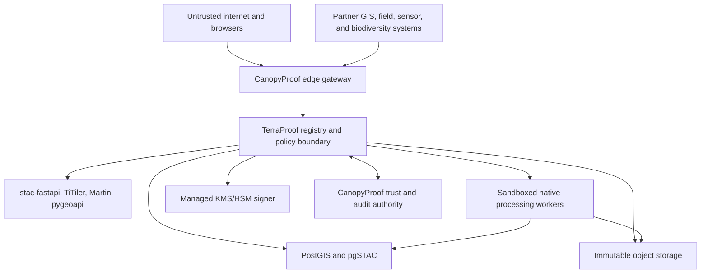

# TerraProof Spatial Threat Model

Status: PROPOSED - ADR approval required

Date: 2026-07-12

Scope: TerraProof Spatial Fabric P0, including ingest, catalog, geometry, object
storage, processing, tiles, manifests, viewers, connectors, and institutional
reporting links

## 1. Security Objectives

TerraProof must preserve:

- tenant, organization, and project isolation;
- integrity and immutability of raw assets, geometry versions, derived products,
  provenance, quality, uncertainty, and audit links;
- confidentiality of restricted data, credentials, and sensitive locations;
- availability under bounded catalog, tile, range-read, geometry, and processing
  workloads;
- authenticity, scope, expiry, and replay resistance of service tokens and map
  manifests;
- license and retention enforcement through every derived/export path;
- CanopyProof human and governance authority over proof and certification;
- Earth-only production behavior.

The system must fail closed. A missing policy, identity, license, CRS, checksum,
provenance edge, uncertainty budget, or review cannot be interpreted as safe.

## 2. Protected Assets

- CanopyProof identities, roles, memberships, projects, and audit events.
- TerraProof metadata, geometry, topology, provenance graph, processing recipes,
  processing runs, quality assessments, and uncertainty budgets.
- Raw and derived raster, vector, multidimensional, offline, and point-cloud
  objects.
- Object registry mappings from opaque IDs to private locations.
- Database, object-store, connector, service-token, and signing credentials.
- Signed map manifests and public verification keys.
- Restricted project locations, sensitive species, community data, and field
  worker/device locations.
- License, consent, retention, legal-hold, and disclosure decisions.
- Institutional reports and the source links supporting their metrics.

## 3. Trust Boundaries

Crossing any boundary requires explicit authentication, authorization, bounded
input, policy evaluation, correlation, and output filtering. Network location
alone is not trust.

## 4. Threat Actors

- Anonymous users enumerating tiles, manifests, projects, or sensitive areas.
- Authenticated users attempting cross-project or cross-tenant access.
- Malicious or compromised partner systems, field devices, and connectors.
- Compromised service identities or leaked short-lived tokens.
- Insider users abusing administrative, data-steward, processing, or reviewer
  privileges.
- Supply-chain attackers targeting geospatial parsers, container images, npm,
  Python, Rust, Java, or native dependencies.
- Attackers supplying malformed geometry, CRS, archives, rasters, point clouds,
  STAC documents, or processing parameters.
- Model developers or automated agents overstating AI output as verified proof.
- External providers changing, deleting, or relicensing source data.

## 5. Entry Points

- Asset/connector registration and upload.
- STAC search and item/collection retrieval.
- Geometry query and vector tile endpoints.
- Raster metadata, preview, range-read, and tile endpoints.
- OGC API requests and approved process execution.
- Processing job submission, parameters, images, and outputs.
- Map-manifest issue and verification endpoints.
- Public MapLibre/deck.gl viewer and caches.
- Offline package import/export.
- SensorThings, ODK, KoboToolbox, QField, Open Foris, OpenDroneMap, FROST, GBIF,
  and partner catalog adapters.
- Administrative policy, license, retention, and disclosure workflows.

## 6. Threat And Control Register

| ID | Threat | Impact | Required controls |
| --- | --- | --- | --- |
| T01 | Cross-tenant ID substitution or query-filter omission | Confidentiality breach and false project lineage | Derive scope from verified identity; mandatory tenant/project predicates; RLS defense in depth; opaque IDs; negative authorization tests. |
| T02 | Insecure direct object reference to an asset, layer, run, or manifest | Unauthorized read/export or inference | Per-object policy decision; non-sequential IDs; audience/purpose checks; no authorization caching across subjects. |
| T03 | Arbitrary URL supplied to TiTiler, GDAL, STAC, or connector path | SSRF, cloud metadata theft, network pivot, unbounded download | Accept registry IDs only; scheme/host/port allowlist; DNS/IP validation before and after connect; redirect cap; deny loopback, link-local, private, and metadata ranges; egress proxy. |
| T04 | Signed URL or storage credential enters a manifest, log, cache, or error | Durable credential leak and asset bypass | Credential-free manifest schema; structured log redaction; response schema validation; secret scanners; object-specific short expiry; never persist delivery URLs. |
| T05 | Service token replay, forwarding, or audience confusion | Cross-service privilege escalation | Short expiry; issuer/audience/purpose/operation binding; nonce or proof-of-possession where feasible; clock policy; revocation; token hash in audit, never token value. |
| T06 | Manifest tampering | Viewer displays unauthorized or falsified data | Canonical serialization; asymmetric signature; checksum; key ID; strict verifier; reject any unsigned or modified field. |
| T07 | Expired manifest replay | Continued access after policy/license/revocation change | Short expiry; audience and project binding; issued-at/not-before checks; nonce/version revocation; cache TTL no longer than manifest lifetime. |
| T08 | Manifest signing-key compromise | Forged public disclosure | Managed KMS/HSM; raw keys unavailable to app; scoped signer identity; dual-control rotation/revocation; publish key validity windows; incident invalidation. |
| T09 | pgSTAC replacement mistaken for immutable history | Lost lineage or silent metadata rewrite | Immutable TerraProof entity versions and CanopyProof audit first; catalog is a projection; reconciliation compares versions/checksums. |
| T10 | Raw or derived object overwritten in place | Evidence tampering and irreproducible reports | Content checksum, object versioning/write-once policy, conditional create, separate quarantine, periodic inventory and hash verification. |
| T11 | PMTiles snapshot overwrites authoritative geometry | Public snapshot becomes hidden write path | One-way generation; no import-to-authority route; source geometry version embedded; database roles prohibit writes from tile services. |
| T12 | Invalid/self-intersecting/oversized geometry | Wrong metrics, query failure, CPU/memory exhaustion | CRS and geometry schema; PostGIS validity checks; coordinate/vertex/ring/area limits; repair only through explicit reviewed derived version. |
| T13 | CRS spoofing, axis-order confusion, unit mismatch, or malicious transform | Spatial displacement and invalid area/carbon calculations | Approved CRS registry; explicit axis/units/body; transformation pipeline/version; bounds checks; golden cases for antimeridian, poles, and area. |
| T14 | Non-Earth or unknown body enters Earth report | Scientifically invalid institutional claim | `bodyId=earth` enforced at every boundary; isolated planetary-lab issuer/audience/storage; report foreign-key/check constraint; negative tests. |
| T15 | Decompression bomb, huge raster dimensions, deep archive, or point-cloud explosion | Worker or storage denial of service | Quarantine; streaming; byte/pixel/band/feature/point/archive-depth limits; time/memory/disk quotas; no nested archive recursion; kill/retry policy. |
| T16 | Crafted file exploits GDAL/Rasterio/PDAL/native parser | Remote code execution or data exfiltration | Minimal pinned images; sandbox/non-root/read-only root; no host mounts; seccomp/runtime isolation; disabled network by default; CVE response and fuzz fixtures. |
| T17 | User-controlled processing command, expression, plugin, or UDF | Code execution and policy bypass | Approved immutable recipe registry; typed parameters; no shell; no arbitrary plugin/UDF; image digest allowlist; separate research environment. |
| T18 | Processing input substitution or nondeterministic environment | False provenance and irreproducible output | Resolve immutable IDs/hashes before queue; canonical parameters; pinned image/software; deterministic seed where relevant; output hash and replay checks. |
| T19 | Processing worker approves its own product | AI/service self-authorization | Separate service and reviewer identities; independent human review; policy prevents generator=reviewer; audit event required before institutional state. |
| T20 | STAC query complexity or pagination abuse | Database saturation and availability loss | Bounded collections, bbox/time ranges, sort fields, page size, query timeout/cost, rate limits, statement limits, read replicas/caches where justified. |
| T21 | COG range amplification or cache-key poisoning | Object-store cost/availability attack or cross-scope cache leak | Validate COG layout; range/byte ceilings; normalized cache key includes tenant/disclosure/version; signed origin requests; request coalescing and quotas. |
| T22 | Martin/pygeoapi/TiTiler exposed directly without auth | Bypass of tenant, license, and disclosure checks | Private origins; gateway-only ingress; service audience auth; network policy; deployment test that public origin paths are unreachable. |
| T23 | Public tile enumeration reconstructs sensitive locations | Harm to species, communities, workers, or projects | Separate generalized geometry; minimum zoom/resolution; aggregation/jitter/masking; no raw feature IDs; anti-bulk controls; disclosure review. |
| T24 | Dataset join re-identifies generalized location | Privacy/safety breach despite individual policy | Join-risk assessment; purpose limitation; minimum cohorts; output scanning; prevent unrestricted client-side joins/exports. |
| T25 | License removed, expired, or forbids redistribution/derivatives | Contractual, ethical, and institutional breach | Versioned license policy; decision at ingest/process/manifest/export; expiry jobs; lineage fan-out lookup; withdrawal/non-reliance workflow. |
| T26 | Attribution stripped from map/export | License breach and unverifiable source | Manifest carries required attribution IDs/text; viewer cannot suppress mandatory attribution; export includes source/license manifest; tests. |
| T27 | External source changes content at the same URL | Input drift and unverifiable result | Ingest immutable copy where permitted; checksum/ETag/time receipt; external version ID; never trust URL identity alone; detect and append new version. |
| T28 | Connector sends forged device/GPS/time/provider metadata | False observation provenance | Authenticated connector/device; signed receipt where available; plausibility/cross-source checks; preserve raw claims; route to review; never auto-certify. |
| T29 | GBIF or public biodiversity data exposes sensitive occurrence | Ecological harm | Apply local sensitive-species policy regardless of public source; generalize before catalog/map; restrict raw export and log access. |
| T30 | Offline GeoPackage/QField package is stale or modified | Conflicting edits and false field record | Package manifest/signature/hash; base version; expiry; per-edit actor/device provenance; conflict review; no direct database import. |
| T31 | Broken provenance edge, cycle, or missing hash | Derived product cannot be reproduced | Referential and hash constraints; acyclic graph validation; completeness gate; no report/manifest eligibility until repaired through append-only records. |
| T32 | Quality score hides failed critical check | Misleading institutional confidence | Preserve individual checks/flags; hard failures cannot be averaged away; methodology-specific gates; reviewer sees raw assessment. |
| T33 | Unknown uncertainty represented as zero | False precision and misleading claim | Typed unknown state; required uncertainty budget; block reportable metric; visualization cannot infer zero or hide interval. |
| T34 | Cross-classification cache reuse | Restricted data delivered to public audience | Cache key binds classification/disclosure/tenant/project/version; separate origins where needed; private responses non-public; purge on revocation. |
| T35 | Log/trace/metric captures precise coordinates or credentials | Secondary data leakage | Structured allowlisted telemetry fields; coordinate redaction/generalization; secret filters; restricted observability access and retention. |
| T36 | Backup, replica, or offline export escapes residency/retention | Regulatory or contractual breach | Inventory all copies; regional placement; encryption/access policy; lifecycle and legal-hold propagation; restore/disposal tests. |
| T37 | Insider changes license, disclosure, quality, or recipe policy | Covert policy weakening | Least privilege; separation of duties; dual approval for material policy; immutable versions; public/internal audit; alerts on broadening access. |
| T38 | Supply-chain compromise in npm/Python/native/container dependencies | Code execution, data corruption, credential theft | Lockfiles and digests; provenance/SBOM; trusted registries; signature verification where available; vulnerability gates; minimal dependency set; rebuild/rollback plan. |
| T39 | AI-generated spatial result presented as verified/certified | Institutional misrepresentation | Advisory label and provenance; API state machine forbids AI final decision; human reviewer and governance references required; bounded claim language. |
| T40 | Challenge or withdrawal not propagated to maps/reports | Known-bad data remains relied upon | Provenance fan-out index; revoke manifests/cache; append status; notify report owners; non-reliance/correction workflow; reconciliation monitor. |

## 7. Service-Specific Controls

### stac-fastapi / pgSTAC

- Private write routes and gateway-authenticated reads.
- Response validation enabled.
- Tenant/project filters injected server-side and impossible to override.
- Extension/version allowlist and strict JSON schema.
- Bounded query fields, geometry, time range, page size, sort, and timeout.
- Catalog mutation reconciled to immutable TerraProof versions and audit events.

### TiTiler

- Registered asset IDs only; no public `url` parameter.
- CORS limited to approved CanopyProof origins.
- Limit bands, expressions, resampling options, tile size, ranges, and output
  formats.
- Disable arbitrary algorithm/plugin execution.
- Read-only object credentials with prefix and classification scope.

### Martin

- Private network and service authentication because authorization is not its
  responsibility.
- Expose only approved views/functions and read-only database roles.
- Restrict SQL/function parameters, zoom, extent, feature count, and timeout.
- Do not expose base tables or sensitive geometry.

### pygeoapi

- Publish only approved read collections/processes.
- No arbitrary provider/config selection from a request.
- Typed process inputs and immutable recipe mapping.
- Gateway authorization, quotas, output validation, and audit correlation.

### Processing Workers

- Separate production and research queues/images/identities.
- Non-root, read-only root filesystem, ephemeral scratch, resource quotas, and
  no outbound network unless a recipe-specific allowlist requires it.
- Resolve inputs before execution and mount/read only immutable objects.
- Write outputs to quarantine; promote only after checksum, schema, quality,
  provenance, and malware/parser checks.

## 8. Required Security Tests

P0 cannot be declared ready until automated tests prove:

1. cross-tenant asset read, search, tile, process, manifest, and export are
   denied;
2. arbitrary URL, redirect to private IP, and DNS rebinding paths are denied;
3. unsigned, expired, wrong-audience, wrong-project, replayed, and tampered
   manifests are denied;
4. restricted assets are absent from public catalog, map, tile, cache, and
   error responses;
5. no-redistribution assets are blocked from export and snapshot generation;
6. sensitive species coordinates are generalized before any public output;
7. unknown/invalid CRS, invalid geometry, excessive geometry, and unsupported
   body are rejected;
8. raw asset overwrite and catalog-only mutation are rejected;
9. derived products preserve immutable input hashes, recipe version, run,
   quality, uncertainty, reviewer, and audit lineage;
10. an AI/service actor cannot approve, certify, or act as its own reviewer;
11. Mars, Moon, unknown, and missing-body assets cannot enter Earth catalog
    disclosure, ESG reports, or proof records;
12. credentials, private URIs, tokens, and precise restricted locations never
    enter manifests, client bundles, logs, errors, or export metadata;
13. PMTiles generation is one-way and cannot mutate authoritative geometry;
14. parser bombs and expensive spatial/catalog queries hit deterministic limits;
15. challenge, expiry, license revocation, and key revocation invalidate future
    access and cached manifests within the declared bound.

Tests must include unit policy tests, integration tests against actual service
configurations, property/fuzz tests for geometry and manifests, and deployment
tests that probe public network exposure.

## 9. Abuse And Availability Limits

Limit values are environment- and methodology-specific but must be explicit for:

- upload and remote-ingest bytes;
- redirects, connection time, total time, and range bytes;
- raster dimensions, bands, overviews, blocks, and decompressed bytes;
- vector features, vertices, rings, properties, and response bytes;
- point count, dimensions, hierarchy depth, and query bounds;
- STAC bbox/time span, predicates, page size, sort fields, and total query cost;
- tile zoom, concurrency, rate, and cache/origin amplification;
- processing CPU, memory, scratch disk, runtime, retries, and concurrent jobs;
- manifest layers, assets, styles, lifetime, and issue rate.

Rate limits supplement authorization and validation; they do not make an unsafe
endpoint safe.

## 10. Detection And Response

Alert on:

- repeated cross-tenant or arbitrary-URL denials;
- unusual manifest issue/verify/replay failures;
- broad tile enumeration or range amplification;
- checksum, immutability, provenance, or deterministic replay failures;
- license expiry/revocation with active products;
- sensitive-location disclosure attempts;
- service-token audience/expiry failures and signer anomalies;
- policy changes that broaden access;
- parser crashes, sandbox violations, queue saturation, and database timeouts;
- challenged/withdrawn data still requested by active reports or manifests.

Incident response preserves evidence, suspends affected access, revokes tokens
or key IDs, traces provenance fan-out, appends challenge/audit events, and issues
corrections or non-reliance notices. It never deletes history to hide an error.

## 11. Residual Risks

- Public visualization can reveal patterns even after coordinate generalization.
- Provider data and licenses can change outside CanopyProof control.
- Native geospatial parsers retain non-zero vulnerability risk despite
  sandboxing and patching.
- Numerical transformations and uncertainty propagation can be scientifically
  wrong while technically reproducible.
- Multi-service workflows can become partially complete during outages.
- Authorized insiders can misuse legitimate access before detection.
- Institutional partners may interpret a spatial layer more strongly than its
  methodology supports.

These risks require ongoing governance, independent science review,
reconciliation, monitoring, training, and bounded public language.

## 12. Security Approval Gate

Implementation remains prohibited until `ADR_SPATIAL_STACK.md` is accepted.
Before P0 readiness, Security must approve the concrete data-flow diagram,
service identities, egress policy, schema/RLS design, manifest cryptography,
sandbox profile, limits, deployment exposure, test evidence, incident runbook,
and residual-risk owners.
